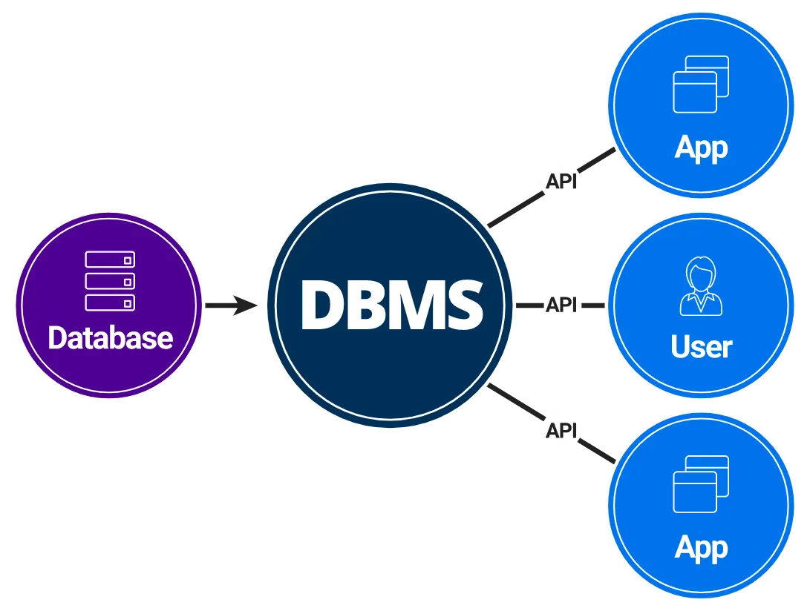
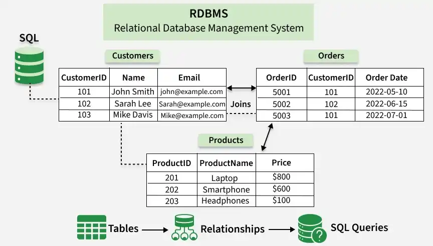
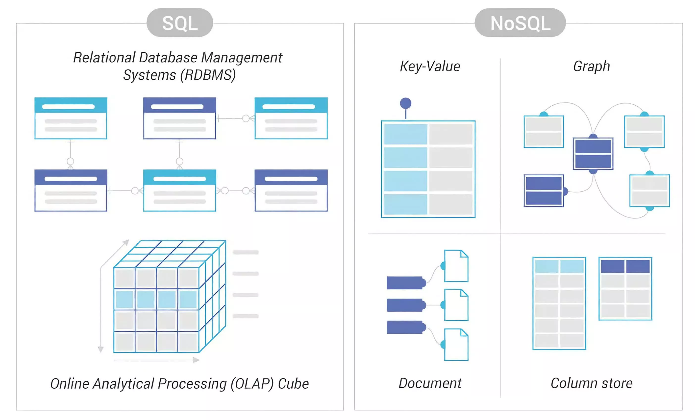
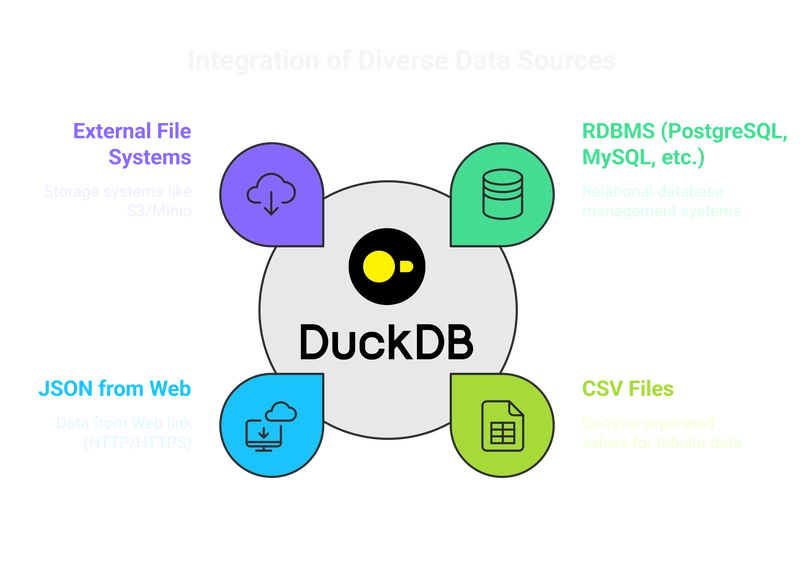
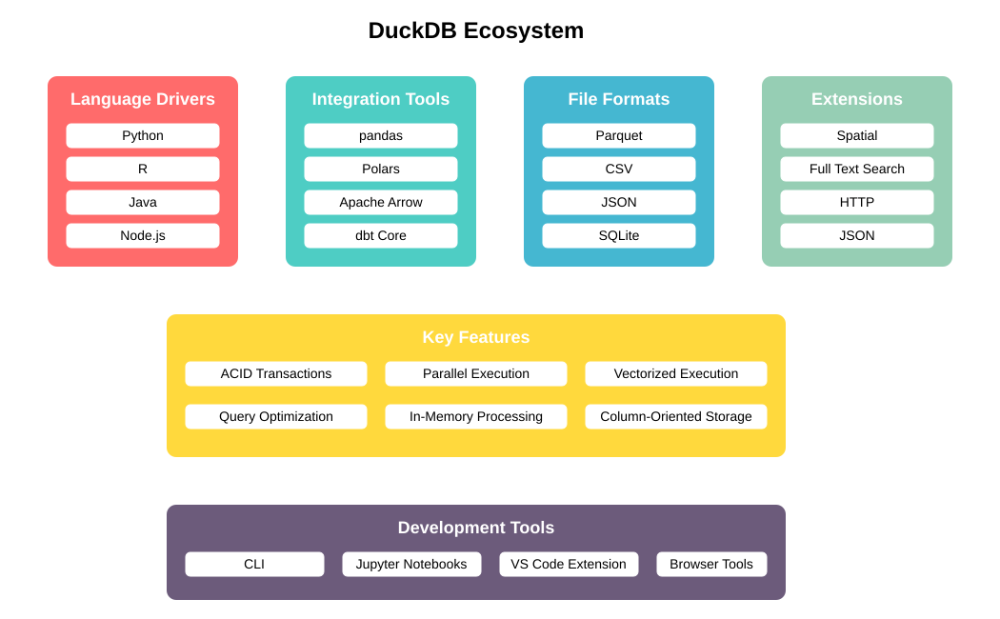

# OMIS-105 :   Introduction to Database Management Systems

@author: [Dr. Mahmoud Parsian](https://www.scu.edu/business/isa/faculty/parsian/)

	In  this course, you will learn  the fundamentals of 
	modern  relational  data management.  Topics include  
	SQL (data language), schema  design, data  modeling,   
	query  data  by  SQL,   database   applications, and 
	transactions.  Through lectures, hands-on labs,  and  
	assignments,  you  will  discover   how   real-world 
	database systems  work, the principles behind  them,  
	and how  they  shape  the  way organizations  store,   
	retrieve,   and   analyze  information   every  day.
	

[Can AI-LLM Write Your SQL? Yes. Should You Trust It? Let's Find Out.](./why_you_must_learn_SQL/why_you_must_learn_SQL.md)

---

# 1. What is a Database?

A database is an organized collection 
of digital data or information stored 
electronically in a system. It allows 
users to store, access, update, and 
manage information quickly.

## How It Works

* Managed by a Database Management 
  System (DBMS) software that controls 
  access and security.
  
* Uses query languages like SQL 
  (Structured Query Language) to 
  find and change data.

* Handles multiple users at the same 
  time without losing data.
  
## Common Types

* **Relational Databases**: Store data in 
  tables with rows and columns; examples:
   
	* DuckDB
	* PostgreSQL
	* MySQL

* **NoSQL Databases**: Store flexible or 
  unstructured data like emails and videos.
 
* **Cloud Databases**: Built and accessed 
  through virtual cloud platforms; examples:
  
	* Snowflake
	* Amazon RDS
	* Google Cloud SQL

---

# 2. Example of a Database

Common database examples include relational 
systems like DuckDB, MySQL, PostgreSQL, and 
document systems like MongoDB. These digital 
storage tools organize information into rows, 
columns, or files so computer programs can 
find and change data fast.

## Relational Databases (SQL)

* **DuckDB**: is an in-process, high-performance 
  analytical SQL database. DuckDB is a fast, 
  embeddable relational database management 
  system designed to run inside host applications 
  without a separate server process, using a 
  columnar storage layout and vectorized query 
  execution to make large-scale data analysis 
  blazing fast.

* **MySQL**: Free software used for websites 
  and online stores.

* **PostgreSQL**: Strong system used in banks 
  and money apps.

* **Microsoft SQL Server**: Tool that works 
  well with Windows programs.

## Non-Relational Databases (NoSQL)

* **MongoDB**: Saves data in flexible, text-like 
  files instead of strict tables.
* **Redis**: Stores quick key-value pairs for 
  fast memory lookups.
* **Apache Cassandra**: Handles massive columns 
  of data across many servers.

---

# 3. What is a Database Management System?

* A Database Management System (DBMS) is the 
  core software used to **create**, **store**, 
  **manage**, and **retrieve** data in a database. 

* It acts as an organized bridge between a 
  central database and the users or applications 
  interacting with it, keeping data consistent, 
  secure, and easily accessible.
  

---

# 4. What is a Relational Database Management System?

* An RDBMS (Relational Database Management System) 
  is software used to store, manage, and retrieve 
  structured data as **tables of rows and columns**.
  

* Data is organized into **tables of rows and columns**, 
  and these tables are linked using keys to ensure data 
  integrity and allow applications to query connected 
  information efficiently.
  
  | `product_id` | `customer_id` | `purchase_date` | `cost` | 
  |:------------:|:-------------:|:---------------:|-------:|
  | P0123789     | C00100745     | 2026-02-23      | 123.45 |
  | P0123700     | C00100745     | 2026-02-26      | 45.00  |

* In an RDBMS (Relational Database Management System), 
  "**relational**" means that data is organized into 
  **tables of rows and columns**, and these tables can 
  be logically linked, or related, to one another using 
  shared data values.
  
 
 
---

# 5. Classic Architecture of DBMS

---

# 6. Key Concepts of "Relational" Data

* **Tables** (Relations): Data is stored in two-dimensional grids. 

* **Row**: Each row represents a single record (e.g., a specific 
  customer), and each column represents a specific attribute 
  (e.g., an email address).

* **Primary Keys**: A unique identifier for every row in a table 
  (like a Customer ID or Product ID) so that no two records are 
  exactly identical.

* **Foreign Keys**: A column in one table that points to the 
  Primary Key of another table. This creates the "relationship" 
  by linking related records across tables.

* **Normalization**: The process of organizing data into multiple 
  related tables to reduce duplication and prevent data errors.

---

# 7. A Table in RDBMS

---

# 8. Set of Tables in RDBMS

---

---

# 9. 🦆 DuckDB as RDBMS

* DuckDB is an analytical in-process SQL 
  database management system.
  
* DuckDB is a lightweight, high-performance 
  analytical database designed for local and 
  embedded data processing. 
  
* Embedded, Serverless Architecture: It runs 
  directly within your application process 
  (like Python) without needing a separate 
  server to be installed or configured, making 
  it highly portable and easy to set up.
  
* Fast Analytical Processing: Built with a 
  columnar query execution engine, it is 
  highly optimized for complex SQL queries, 
  aggregations, and instantly querying large 
  files (like Parquet and CSV) directly from 
  your local disk or cloud storage.

# 10. 📊 Integration of Data Sources

# 11. 🔧 DuckDB Ecosystem

# 12. 🧑‍🎓  Target Students

* This course is designed for undergraduate students 
at the department of
[Information Systems and Analytics](https://www.scu.edu/business/isa/academics/courses/), 
Santa Clara University.

---

# 13. 🏛️  Course Description 

* [This course](https://www.scu.edu/business/isa/academics/courses/) 
presents issues related to databases 
and database management systems (DBMS).
 
* Students will acquire technical and managerial 
skills in planning, analysis, design, implementation, 
and maintenance of databases. 

* Hands-on training in relational database design, 
normalization, SQL, and database implementation 
will be provided. 

* Use of DBMS software is required. Emphasis is placed 
on the issues of managing a database environment. 

---

# 14. Course Prerequisite: 

* OMIS-30: Introduction to Programming

---

# 15. 🗄️ Files/Folders

| File Name                    | Description     |
|------------------------------|-----------------|
|[`README.md`](./README.md)    | The file you are reading/viewing |
|[`course_information`](./course_information) | Course Information (labs, grading , ...)|
|[`course_information/ASSIGNMENTS_and_GRADING.md`](./course_information/ASSIGNMENTS_and_GRADING.md) | Assignments, Labs, and Exams |
|[`course_information/INSTRUCTOR.md`](./course_information/INSTRUCTOR.md) | Mahmoud Parsian, Instructor |
|[`course_information/LAB-IN-CLASS-POLICY.md`](./course_information/LAB-IN-CLASS-POLICY.md) | Lab-in-Class Policies |
|[`course_information/REQUIRED_SOFTWARE.md`](./course_information/REQUIRED_SOFTWARE.md) | Required Software |
|[`course_information/SOFTWARE_INSTALLATION.md`](./course_information/SOFTWARE_INSTALLATION.md)| Guide to Software Installation |
|[`course_information/ACADEMIC_CONDUCT.md`](./course_information/ACADEMIC_CONDUCT.md)| Academic Conduct |
|[`course_information/REQUIRED_BOOK.md`](./course_information/REQUIRED_BOOK.md)| Required Book (none — all materials in this repo) |
|[`course_information/CLASS_ATTENDANCE.md`](./course_information/CLASS_ATTENDANCE.md) | Class Attendanace is Mandatory|
|[`outline-10-weeks`](./outline-10-weeks) | Outline/TOC for 10 Weeks|
|[`weekly_lectures`](./weekly_lectures) | Weekly Lectures and Notebooks: 10 weeks |
|[`weekly_reviews`](./weekly_reviews) | Cumulative review notebooks & lecture notes: Weeks 1–3, 4–6, 7–8, 9–10 |
|[`books`](./books) | DuckDB and Database Books |
|[`data_stories`](./data_stories) | Data Stories: 35 self-contained Marimo notebooks for deep learning — see [`data_stories/README.md`](./data_stories/README.md) for **which story maps to which week** |
|[`duckdb_resources`](./duckdb_resources)| DuckDB Resources and Examples| 
|[`tutorials`](./tutorials) | Database Tutorials and Notebooks|
|[`applications`](./applications) | Sample Streamlit apps built with DuckDB (e.g. the In-N-Out POS + analytics teaching app) |
|[`data`](./data) | Sample data files (CSV and Parquet) |
|[`software_installation`](./software_installation) | Steps to make sure Python, DuckDB, and Marimo are installed properly|

---

# 16. References

[1. SQL Introduction - DuckDB Documentation](https://duckdb.org/docs/current/sql/introduction)

[2. What is a Relational Database - Google](https://cloud.google.com/learn/what-is-a-relational-database)

[3. What is a Relational Database - IBM](https://www.ibm.com/think/topics/relational-databases)

[4. What is a Relational Database - Microsoft](https://azure.microsoft.com/en-us/resources/cloud-computing-dictionary/what-is-a-relational-database)

[5. Introduction to SQL - Github](https://github.com/bobbyiliev/introduction-to-sql)

[6. SQL Tutorial - w3schools](https://www.w3schools.com/sql/)

[7. SQL Tutorial - geeksforgeeks](https://www.geeksforgeeks.org/sql/sql-tutorial/)