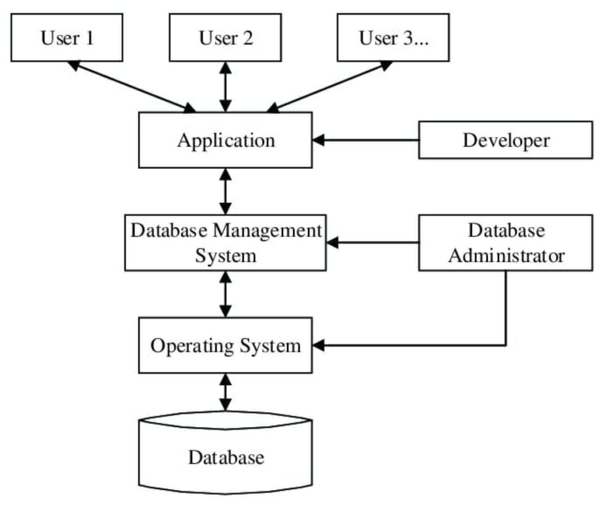
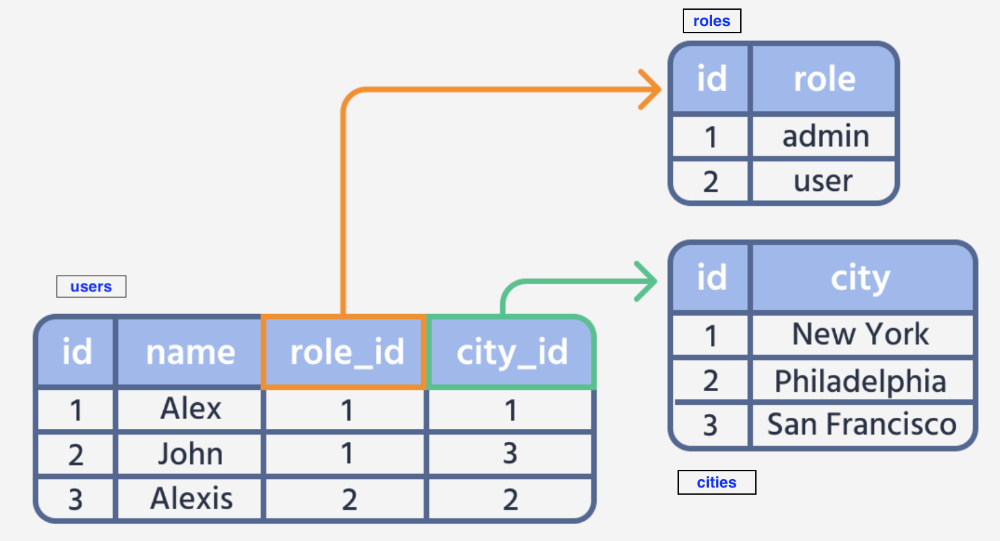

# OMIS 105 <br> Introduction to Database Management Systems

[](https://duckdb.org)
[](https://www.python.org)
[](https://marimo.io)
[](https://www.timestored.com/qstudio/)

**Instructor:** [Dr. Mahmoud Parsian](https://www.scu.edu/business/isa/faculty/parsian/)

# 1. 🏛️ Course Description

* In [this course](https://www.scu.edu/business/isa/academics/courses/), 
you will learn the fundamentals of modern relational data 
management. Topics include SQL, schema design, data modeling, 
querying data with SQL, database applications, and transactions.

* Through lectures, hands-on labs, and assignments, 
you will discover how real-world database systems 
work, the principles behind them, and how they shape 
the way organizations store, retrieve, and analyze 
information every day.

* This course covers the core issues in databases and database 
  management systems (DBMS).
* Students will acquire technical and managerial skills in planning, analysis,
  design, implementation, and maintenance of databases.
* Hands-on training in relational database design, normalization, SQL,
  and database implementation is provided.
* Use of a DBMS ([DuckDB](https://duckdb.org)) is required. The course emphasizes the practical issues of managing
  a database environment.

---

# 2. 🧑‍🎓 Target Students

* This course is designed for undergraduate students in the [Department of Information Systems and Analytics](https://www.scu.edu/business/isa/academics/courses/), Santa Clara University.

---

# 3. Course Prerequisite

* [OMIS 30: Introduction to Programming](https://www.scu.edu/business/isa/academics/courses/)

---

# 4. [Can AI-LLM Write Your SQL?](./why_you_must_learn_SQL/why_you_must_learn_SQL.md)

---

# 5. 🗄️ Folders

| Folder Name                    | Description     |
|------------------------------|-----------------|
|[`README.md`](./README.md)    | The file you are reading/viewing |
|[`course_information`](./course_information) | Course information (labs, grading, policies, and more) |
|[`outline-10-weeks`](./outline-10-weeks) | Outline/TOC for 10 Weeks |
|[`weekly_lectures`](./weekly_lectures) | Weekly Lectures and Notebooks: 10 weeks |
|[`weekly_reviews`](./weekly_reviews) | Weekly Reviews and Notebooks: 10 weeks |
|[`sample_lab`](./sample_lab) | A preview in-class lab (Marimo notebook) — see [`sample_lab/README.md`](./sample_lab/README.md), or [view the solution's rendered output](https://mahmoudparsian.github.io/OMIS-105/sample_lab/solution_output.html) |
|[`books`](./books) | DuckDB and Database Books |
|[`data_stories`](./data_stories) | Data Stories: 36 self-contained Marimo notebooks for deep learning — see [`data_stories/README.md`](./data_stories/README.md) for **which story maps to which week** |
|[`resources`](./resources)| DuckDB Resources, Examples, Sample Databases |
|[`tutorials`](./tutorials) | Database Tutorials and Notebooks |
|[`applications`](./applications) | Sample Streamlit apps built with DuckDB (e.g. the In-N-Out POS + analytics teaching app) |
|[`data`](./data) | Sample data files (CSV and Parquet) |
|[`software_installation`](./software_installation) | Required software and step-by-step install/verification guides for Python, DuckDB, Marimo, Pandas, and qStudio |

---

# 6. What is a Database?

A database is an organized collection of digital 
data or information, stored electronically in a 
system. It lets users **store**, **access**, 
**update**, and **manage** information quickly.



## How It Works

* Managed by a Database Management System (DBMS) — software that controls access and security.
* Uses query languages like SQL (Structured Query Language) to find and change data.
* Handles multiple users at the same time without losing data.

## Common Types

* **Relational Databases**: Store data in tables with rows and columns. Examples: DuckDB, PostgreSQL, MySQL.
* **NoSQL Databases**: Store flexible or unstructured data, like emails and videos.
* **Cloud Databases**: Built and accessed through virtual cloud platforms. Examples: Snowflake, Amazon RDS, Google Cloud SQL.

---

# 7. Example of a Database

Common database examples include relational systems like DuckDB,
MySQL, and PostgreSQL, and document systems like MongoDB. These
digital storage tools organize information into rows, columns, or
files so computer programs can find and change data fast.

## Relational Databases (SQL)

* **DuckDB**: An in-process, high-performance analytical SQL database. It runs inside your application (no separate server needed) and uses columnar storage with vectorized query execution to make large-scale data analysis fast.
* **MySQL**: Free software used for websites and online stores.
* **PostgreSQL**: A strong, reliable system used in banks and finance apps.
* **Microsoft SQL Server**: A tool that works well with Windows programs.

## Non-Relational Databases (NoSQL)

* **MongoDB**: Saves data in flexible, text-like files instead of strict tables.
* **Redis**: Stores quick key-value pairs for fast memory lookups.
* **Apache Cassandra**: Handles very large amounts of data spread across many servers.

---

# 8. What is a Database Management System?

* A Database Management System (DBMS) is the core software used to **create**, **store**, **manage**, and **retrieve** data in a database.
* It acts as a bridge between a central database and the users or applications that interact with it, keeping data consistent, secure, and easily accessible.


---

# 9. What is a Relational Database Management System?

* An RDBMS (Relational Database Management System) is software used to store, manage, and retrieve structured data as **tables of rows and columns**.


* Data is organized into **tables of rows and columns**, and these tables are linked using keys to ensure data integrity and let applications query connected information efficiently.

  | `product_id` | `customer_id` | `purchase_date` | `cost` |
  |:------------:|:-------------:|:---------------:|-------:|
  | P0123789     | C00100745     | 2026-02-23      | 123.45 |
  | P0123700     | C00100745     | 2026-02-26      | 45.00  |

* In an RDBMS, "**relational**" means that data is organized into **tables of rows and columns**, and these tables can be logically linked, or related, to one another using shared data values.

---

# 10. Relational Database Tables

Relational database tables are joined using 
shared values between common columns, typically 
a **primary key (PK)** from one table and a 
**foreign key (FK)** in another, to combine 
rows from multiple tables into a single result.



### [Tables and Relationships: `users`, `roles`, and `cities`](./resources/sample_databases/users_roles_cities_tiny/users_roles_cities.md)

| Table name | Table Definition | Primary Key | Foreign Key(s) |
| ---------- | ---------------- | ----------- | -------------- |
| `roles` | `CREATE TABLE roles (` <br> `  id INTEGER PRIMARY KEY,` <br> `  role VARCHAR NOT NULL` <br> `);` | `roles.id` | |
| `cities` | `CREATE TABLE cities (` <br> `  id INTEGER PRIMARY KEY,` <br> `  city VARCHAR NOT NULL` <br> `);` | `cities.id` | |
| `users` | `CREATE TABLE users (` <br> `  id INTEGER PRIMARY KEY,` <br> `  name VARCHAR NOT NULL,` <br> `  role_id INTEGER,` <br> `  city_id INTEGER,` <br><br> `  -- Defining the Foreign Key constraints` <br> `  FOREIGN KEY (role_id) REFERENCES roles(id),` <br> `  FOREIGN KEY (city_id) REFERENCES cities(id)` <br> `);` | `users.id` | `users.role_id -> roles.id` <br> `users.city_id -> cities.id` |

---

# 11. Classic Architecture of DBMS


---

# 12. Key Concepts of "Relational" Data

* **Tables** (Relations): Data is stored in two-dimensional grids.
* **Row**: Each row represents a single record (for example, a specific customer).
  Each column represents a specific attribute (for example, an email address).
* **Primary Keys**: A unique identifier for every row in a table (like a Customer ID
  or Product ID), so that no two records are exactly identical.
* **Foreign Keys**: A column in one table that points to the Primary Key of another table.
  This creates the "relationship" by linking related records across tables.
* **Normalization**: The process of organizing data into multiple related tables to
  reduce duplication and prevent data errors.

---

# 13. A Table in RDBMS


---

# 14. Set of Tables in RDBMS


---


---

# 15. 🦆 DuckDB as RDBMS

* DuckDB is an analytical, in-process SQL database management system.
* DuckDB is lightweight and high-performance, designed for local and embedded data processing.
* **Embedded, serverless architecture**: DuckDB runs directly inside your application process
  (like Python) — no separate server to install or configure. This makes it portable and easy to set up.
* **Fast analytical processing**: Built with a columnar query execution engine, DuckDB is optimized for
  complex SQL queries, aggregations, and instantly querying large files (like Parquet and CSV) directly
  from your local disk or cloud storage.

---

# 16. 📊 Integration of Data Sources


---

# 17. 🔧 DuckDB Ecosystem


---

# 18. 🗓️ Weekly Topics

Ten weeks, two 2-hour sessions each. This table is the authoritative
topic list for the course.

| Week | Topic | Key SQL Concepts |
|------|-------|-----------------|
| 01 | Database Foundations | `SELECT`, `WHERE`, `ORDER BY`, `LIMIT`, `LIKE`, `DISTINCT` |
| 02 | Relational Modeling | `GROUP BY`, `HAVING`, multi-table schemas |
| 03 | SQL Basics | `CASE`, string functions, `UPPER`, `YEAR`, computed columns |
| 04 | SQL Aggregation | `COUNT`, `SUM`, `AVG`, `MIN`, `MAX`, `INNER JOIN`, `LEFT JOIN` |
| 05 | SQL Joins | Multi-table `JOIN`, `LEFT JOIN`, `IS NULL`, `COALESCE` |
| 06 | Database Design | Normalization (1NF, 2NF, 3NF), decomposition |
| 07 | Query Performance | Window functions (`ROW_NUMBER`, `RANK`), `EXPLAIN`, indexes, CTEs |
| 08 | Transactions & ACID | `BEGIN`, `COMMIT`, `ROLLBACK`, `CHECK`, `NOT NULL` |
| 09 | Project Integration | CTEs, subqueries, `EXISTS`, `LAG`, `LEAD`, `NTILE`, `FIRST_VALUE` |
| 10 | Review & Modern Data | JSON querying, `PIVOT`, `LIST`, `UNNEST`, `CROSS JOIN` |

The [`weekly_lectures/`](./weekly_lectures) slide decks and the
[10-week outline](./outline-10-weeks) describe a somewhat slower pacing.
Where the two disagree, the table above is the one to follow.

Graded work is 20 in-class labs (30 points each), a midterm, and a final
— see [`course_information/ASSIGNMENTS_and_GRADING.md`](./course_information/ASSIGNMENTS_and_GRADING.md)
for the full breakdown.

---

# 19. 🛠️ Working in This Repository

Notes for anyone editing or extending the course materials.

## Notebook Conventions (Marimo + DuckDB)

Every notebook in this repository runs SQL through `con.execute()`
against an in-memory DuckDB connection — **not** through `mo.sql()`:

```python
import duckdb
con = duckdb.connect(database=":memory:")   # this cell returns (con,)
...
con.execute("CREATE OR REPLACE TABLE ...")  # DDL/DML: no .fetchdf()
con.execute("SELECT ...").fetchdf()         # a query cell ends with .fetchdf()
```

- Every cell that touches the database takes `con` as a parameter
  (`def _(con):`). That is what wires the cell into Marimo's reactivity
  graph, since `con.execute()` does not register table names as Python
  variables the way `mo.sql()` did.
- Use `CREATE OR REPLACE TABLE` so a notebook can be re-run.
- Markdown cells: `mo.md("""...""")` with `hide_code=True`.
- No Python comments (`#`) inside SQL — use `--`, so Marimo renders the
  cell as native SQL.
- All of `weekly_lectures/` and `weekly_reviews/` follows this pattern. A
  few older notebooks in `data_stories/`, `tutorials/`, and `resources/`
  still use `mo.sql()`; convert one if you happen to edit it.

## Verifying a Notebook

A Marimo notebook is a runnable Python file. Run it **from its own
folder**, so relative `data/` paths resolve, and run it **twice** — the
second run is what catches a missing `CREATE OR REPLACE`:

```bash
cd weekly_lectures/week03-sql-basics
MPLBACKEND=Agg python3 demo1.py && MPLBACKEND=Agg python3 demo1.py
```

Exit code 0 means every cell ran. This is a real check: a notebook
querying a table that does not exist exits 1. Running a notebook does not
rewrite the file, so it is safe to do on a dirty working tree.

## ⚠️ `marimo check --fix` — never point it at a directory

`marimo check --fix` treats **every** `.md` file it finds as a notebook
and rewrites it, injecting YAML frontmatter into plain Markdown and
escaping any `"""` inside. Pointed at a lecture or review folder it will
mangle READMEs, slide decks, labs, quizzes, and notes. `--ignore-scripts`
does not prevent this.

- Safe: `marimo check` (read-only, no `--fix`) — always.
- Safe: `marimo check --fix weekly_reviews/week01-*/*.py` — name the
  `.py` files explicitly.
- Recovery, if it happens: `git checkout -- .`

`.marimo.toml` at the repository root sets `[lint] ignore = ["MF007"]`.
MF007 is `markdown-indentation`: Marimo wants `mo.md()` bodies dedented
to column 0, but this course indents them to match the surrounding
Python. That style is deliberate.

## Writing Style

Course materials are written for senior business students with zero prior
SQL exposure, many of them ESL:

- Short sentences, simple vocabulary.
- Warm, encouraging, professional tone.
- No jargon without an explanation on first use.
- Bullet points for steps and options — prose otherwise.
- Footer on course documents:
  `*OMIS 105 — Introduction to Database Management Systems — Fall 2026*`

---

# 20. 📗 References

[1. SQL Introduction - DuckDB Documentation](https://duckdb.org/docs/current/sql/introduction)

[2. What is a Relational Database - Google](https://cloud.google.com/learn/what-is-a-relational-database)

[3. What is a Relational Database - IBM](https://www.ibm.com/think/topics/relational-databases)

[4. What is a Relational Database - Microsoft](https://azure.microsoft.com/en-us/resources/cloud-computing-dictionary/what-is-a-relational-database)

[5. Introduction to SQL - GitHub](https://github.com/bobbyiliev/introduction-to-sql)

[6. SQL Tutorial - w3schools](https://www.w3schools.com/sql/)

[7. SQL Tutorial - geeksforgeeks](https://www.geeksforgeeks.org/sql/sql-tutorial/)
