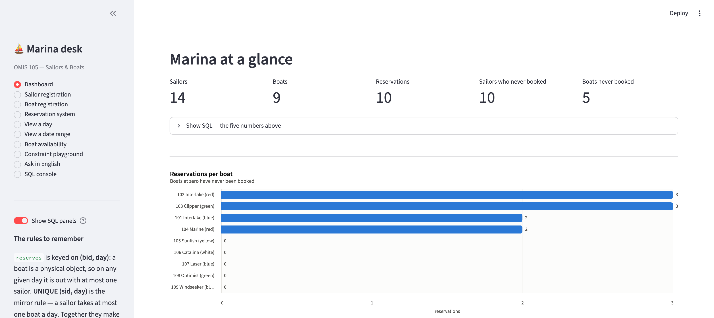

# Sailors, Boats, and Reservations

**OMIS 105 · Santa Clara University** — the textbook Sailors / Boats / Reserves
schema, taken end to end: a DuckDB database whose constraints do the arguing,
five Marimo notebooks, and a Streamlit app that shows the SQL behind everything
it draws.



```bash
uv sync                            # install (needs uv; see §12)
./create_database.sh --verify      # build the database, watch 11 forbidden inserts get rejected
./run_app.sh                       # the app above    ./run_notebook.sh — the notebooks
```

**Three tables. 71 queries. One decision worth the whole project.**

| | |
|---|---|
| **The database** | Three tables, ten rules, every one defined beside the constraint that enforces it. `reserves` is keyed on **`(bid, day)`** — *not* the textbook's `(sid, bid, day)`, which enforces neither reservation rule. [§6](#6-the-one-decision-that-matters) argues it; `./create_database.sh --verify` proves it. |
| **The notebooks** | Five of them: a guided tour, then four graded levels from `WHERE` to relational division, window functions, `PIVOT` and recursive calendars. No plotting code inside — all 29 charts live in `src/`. [§8](#8-the-marimo-notebook) |
| **The app** | Ten pages, including a constraint playground that *tries* to break each rule, and an "Ask in English" page that turns a question into checked SQL. [§9](#9-the-streamlit-application) |
| **The scale** | A second dataset — 235 sailors, 44 boats, 5,000 reservations across three years — generated reproducibly on the same schema. [`DATASET_2.md`](DATASET_2.md) |
| **What it teaches** | Every concept mapped to the query that teaches it, and the trap it turns on. [`CONCEPTS.md`](CONCEPTS.md) |
| **Proof it works** | `./run_tests.sh` — 155 checks, no pytest, no API key. [§10](#10-verification) |

New to the project? Read [§6](#6-the-one-decision-that-matters) first — it is the
one idea everything else rests on. Teaching from it? Start with
[`CONCEPTS.md`](CONCEPTS.md).

---

This single file is both **the assignment** (what was asked for, Part I) and
**the solution** (what was built, why, and how it is verified, Parts II–VII).

---

## Contents

**Part I — The assignment**
  [1. Introduction](#1-introduction) ·
  [2. Database requirements](#2-database-requirements) ·
  [3. Deliverables](#3-deliverables)

**Part II — Running it**
  [4. Quick start](#4-quick-start) ·
  [5. Project layout](#5-project-layout--every-file-and-folder)

**Part III — The design decision**
  [6. Why `reserves` is keyed on `(bid, day)`](#6-the-one-decision-that-matters)

**Part IV — What was built**
  [7. The database](#7-the-database) ·
  [7.2 What it all teaches](#72-what-it-all-teaches) ·
  [8. The notebook](#8-the-marimo-notebook)
  ([8.1 the four level notebooks](#81-the-four-level-notebooks)) ·
  [9. The application](#9-the-streamlit-application)

**Part V — Evidence**
  [10. Verification](#10-verification) ·
  [11. Bugs found by testing](#11-bugs-found-by-testing-and-what-caught-them)

**Part VI — Reference**
  [12. What is `uv`?](#12-what-is-uv-and-why-every-command-starts-with-it) ·
  [13. Maintainer notes](#13-notes-for-whoever-maintains-this)

---
---

# Part I — The assignment

## 1. Introduction

All of the work lives in one self-contained folder:

```
data_stories/sailors_and_boats/
```

The story and the initial data come from `sailors_and_boats_SQL_Tutorial.pdf`.

There are **three sets of data**:

```
   sailors(sid: integer, sname: string, rating: integer, age: real);

   boats(bid: integer, bname: string, color: string);

   reserves(sid: integer, bid: integer, day: date)
```

Two entities and one relationship between them: a sailor reserves a boat, on a
day. Everything that follows is about getting that middle table right.

## 2. Database requirements

**Every database requirement is defined in exactly one place: the
`REQUIREMENTS` block at the top of [`database/sql/01_schema.sql`](database/sql/01_schema.sql).**

That block states each rule, gives it a label, and names the constraint that
enforces it — so a requirement and its implementation sit on the same screen and
cannot drift apart. Nothing anywhere else in this project restates a rule; every
other file *cites the label*. To change a requirement, change it there.

| labels | what they cover | implemented in |
|---|---|---|
| **R1–R10** | schema rules — keys, uniqueness, dates, the reservation rules | [`database/sql/01_schema.sql`](database/sql/01_schema.sql) |
| **P1–P3** | population — tutorial data, never-reserved boats, never-reserving sailors | [`database/sql/02_data.sql`](database/sql/02_data.sql) |
| **D1–D2** | derived rules — foreign keys, domain checks | [`database/sql/01_schema.sql`](database/sql/01_schema.sql) |

The same block carries design notes **[A]–[D]** explaining *why* each constraint
is the one it is, with worked examples. [`DESIGN.md`](DESIGN.md) is the
long-form version of that reasoning; it cites the labels rather than repeating
the rules.

The block opens by stating **the two core rules** the `reserves` table exists to
enforce — one per side of the sailor–boat relationship, each about a single day.
**R10** is the sailor side; **R2** and **R3** are the boat side, with **R4** and
**R8** the same boat-side rule seen from other angles. Each labelled entry then
carries a *READ AS* note tying it back to whichever core rule it states, so the
assignment's own wording is preserved without leaving room to misread it.

Two of the rules are the graded ones:

- **R9** asks whether `UNIQUE (sid, bid, day)` is redundant. **It is** — see
  [§6](#6-the-one-decision-that-matters) and [`DESIGN.md`](DESIGN.md) §3.
- **R10** is the one rule the primary key cannot deliver, and needs a second
  constraint of its own — [§6.1](#61-why-sid-bid-day-should-not-be-the-primary-key)
  shows what a schema without it accepts.

To watch the rules actually bite:

```bash
./create_database.sh --verify
```

It attempts a forbidden insert for each rule and prints the database's own
rejection, labelled `R2/R3`, `R10`, `D1` and so on. That output *is* the
requirement-coverage report — coverage is demonstrated, not asserted.

## 3. Deliverables

### Marimo notebook

A comprehensive notebook containing:

* 3 simple queries
* 5 intermediate queries
* 5 intermediate queries with plots (**plotting code must be out of the notebook**)
* 3 advanced queries

Delivered in [§8](#8-the-marimo-notebook), which also adds three further parts
beyond the graded sixteen — and, in [§8.1](#81-the-four-level-notebooks), four
more notebooks of ten queries each — twelve at Level 4 — covering basic,
intermediate, intermediate+ and advanced, plotted the same way and with no
query repeated between them.

### Streamlit application

A comprehensive application providing:

1. Sailor registration
2. Boat registration
3. Reservation system
4. View registration for a day
5. View registration for a day range
6. … (open-ended)

Delivered in [§9](#9-the-streamlit-application) as ten pages.

---
---

# Part II — Running it

## 4. Quick start

```bash
git clone https://github.com/mahmoudparsian/OMIS-105.git
cd OMIS-105/data_stories/sailors_and_boats

uv sync                            # install dependencies (once, after cloning)
./create_database.sh --verify      # build the DB from database/sql/, prove the rules bite
./create_database_2.sh --verify    # optional: the second, larger dataset (§7.1)
./run_tests.sh                     # full suite — 155 checks

./run_notebook.sh                  # the guided SQL notebook (Marimo)
./run_notebook_level_01.sh         # …and the four graded levels: 10 queries each (12 at level 4)
./run_notebook_level_02.sh
./run_notebook_level_03.sh
./run_notebook_level_04.sh
./run_app.sh                       # the marina desk app (Streamlit)
```

Never installed `uv`? See [§12](#12-what-is-uv-and-why-every-command-starts-with-it) — it is one command, and
you do not need Python first.

**Every script takes an optional database path** as its first argument and
forwards the rest to the underlying tool, so you can experiment safely:

```bash
cp sailors_and_boats.duckdb /tmp/scratch.duckdb   # take a copy
./run_app.sh /tmp/scratch.duckdb                  # app writes there instead
./run_app.sh /tmp/scratch.duckdb --server.port 8600
```

They work from any directory, and `--help` on any of them prints its own
documentation.

> **Run one at a time.** DuckDB allows many readers *or* one writer, so the
> notebook and the app cannot hold the same database file open at once. The
> scripts warn you when they detect the other one running. To run both, point
> the notebook at a copy (as above).
>
> For the same reason **`./run_tests.sh` fails while the app is running** — the
> suite needs a writable connection the app is holding. Stop the app, or give
> the suite its own database:
> `SAILORS_DB=/tmp/scratch.duckdb uv run python src/build_database.py` then
> `./run_tests.sh /tmp/scratch.duckdb`.

## 5. Project layout — every file and folder

**This section is the one place the project layout is documented.** If you add a
file, add a row here.

```
sailors_and_boats/
├── database/             ← the source of truth. Everything else derives from it.
│   ├── sql/              ←   the schema, and the tutorial's rows
│   └── sql_2/            ←   the second dataset: 2024–2026, generated
├── src/                  ← Python library: data access, charts, text-to-SQL
├── app/                  ← the Streamlit application
├── notebooks/            ← five Marimo notebooks: the guided one, plus levels 1–4
├── tests/                ← the smoke suite
├── docs/screenshots/     ← one PNG per app page, plus the capture script
├── *.sh                  ← the nine entry points you actually run, plus _shared.sh
└── README.md, DESIGN.md, CLAUDE.md   ← the documentation
```

### 5.1 Scripts you run

| file | what it does |
|---|---|
| `create_database.sh` | Builds `sailors_and_boats.duckdb` from **every** `database/sql/*.sql` in filename order. `--verify` then attempts a forbidden insert per rule. Refuses to overwrite an existing database without `--force`, because a rebuild discards anything the app wrote. |
| `run_app.sh` | Starts the Streamlit app. |
| `create_database_2.sh` | Builds `sailors_and_boats_2.duckdb` from `database/sql/01_schema.sql` + `database/sql_2/02_data.sql` — the same schema with the larger dataset. `--regenerate` rewrites the data file first; `--verify` and `--force` behave as above. |
| `run_notebook.sh` | Opens the guided Marimo notebook (read-only against the database). |
| `run_notebook_level_01.sh` … `_04.sh` | Open the four level notebooks — 10 queries each (12 at Level 4), basic → advanced. Same arguments as `run_notebook.sh`. |
| `run_tests.sh` | Runs the whole suite (121 checks). |
| `_shared.sh` | Not run directly — the shared preamble every script sources: argument parsing, `SAILORS_DB` export, `.env` loading, and `open_notebook`, which is the entire body of the five notebook scripts. Add shell helpers here, not to individual scripts. |

### 5.2 The database

Everything the databases are built *from* lives in `database/`. The two
`.duckdb` files are build artifacts and sit at the project root, where the
scripts and `sailors_db.DB_PATH` expect them.

**`database/sql/` is inside a glob and `database/sql_2/` is not** — that is the
whole reason for the second folder. `create_database.sh` runs *every*
`database/sql/*.sql`, so a data file placed there would load into the tutorial
database as well; `create_database_2.sh` names its two scripts explicitly. See
[`DATASET_2.md` §C](DATASET_2.md#c-the-rule-that-shapes-everything-databasesql-is-a-glob).

| file | what it is | edit it? |
|---|---|---|
| `database/sql/01_schema.sql` | The three `CREATE TABLE`s **and the `REQUIREMENTS` block** — the single definition of every database rule. | **Yes** |
| `database/sql/02_data.sql` | The seed rows: tutorial data (P1), never-reserved boats (P2), never-booking sailors (P3). | **Yes** |
| `database/sql_2/02_data.sql` | The second dataset: 235 sailors, 44 boats, 5,000 reservations over 2024–2026. **Generated** — see `src/generate_data_2.py`. | No — regenerate |
| `sailors_and_boats.duckdb` | Build artifact. Regenerate it; never hand-edit it, never treat it as truth. Git-ignored. | No |
| `sailors_and_boats_2.duckdb` | Build artifact of the second dataset. Optional; nothing depends on it existing. Git-ignored. | No |
| `sailors_and_boats_SQL_Tutorial.pdf` | The textbook source for the story and the seed data. | No |

### 5.3 Python

| file | what it is |
|---|---|
| `src/sailors_db.py` | The data-access layer, shared by app and notebook. Connections, `q()`, the `SqlLog` behind every *Show SQL* panel, and every write helper. `DB_PATH` here is the **only** place the database location is decided. |
| `src/build_database.py` | Builds the database from `database/sql/*.sql` (or from an explicit `--sql` list) and implements `--verify`, whose forbidden statements are built from fixtures picked out of whichever database it was handed. |
| `src/generate_data_2.py` | Writes `database/sql_2/02_data.sql`. Holds the specification for the second dataset — sailor counts, colour mix, month weights — and a fixed seed, so the file is reproducible. |
| `src/plots.py` | The six charts of the guided notebook and the app, plus the shared `style()`, palette and `count_axis()` every other chart module uses. Kept out of the notebooks because the assignment requires it. |
| `src/plots_level_01.py` … `_04.py` | The 23 charts of the four level notebooks, one module per level. Same rule: no plotting code in a notebook. |
| `src/text_to_sql.py` | The *Ask in English* page: schema introspection, the cached prompt, `validate_select()` (the security boundary), `dry_run()`, `repair_sql()`. |
| `app/streamlit_app.py` | The ten-page application. |
| `notebooks/notebook_guided.py` | The 16 graded queries plus three extra parts. No plotting code — it calls `src/plots.py`. |
| `notebooks/notebook_level_01.py` … `_04.py` | The four level notebooks: 10 queries each and 12 at Level 4, 42 in total, no query repeated between them. Each calls its own `src/plots_level_0N.py`. |
| `tests/test_smoke.py` | The whole suite in one plain script. No pytest, so students can run it as-is. |

### 5.4 Documentation

| file | what it is |
|---|---|
| `README.md` | This file — assignment, solution, tour and reference. |
| `DESIGN.md` | Why the schema is shaped the way it is. Explains; does not define. |
| `DATASET_2.md` | How the second database is generated and built, end to end — the specification, the generator, the build script, the checks, and how to change any of it. |
| `CONCEPTS.md` | The concept index: every idea the course teaches, mapped to the query that teaches it and the trap it turns on. Points at cells; never explains them. |
| `CLAUDE.md` | Instructions for Claude Code: invariants, gotchas, and what not to "fix". **Local only** — the repository ignores `CLAUDE.md*`, so it is not on GitHub. |
| `docs/screenshots/*.png` | One per app page. `_capture.py` regenerates them with Playwright against a running app. |
| `docs/screenshots/_hero.png` | The banner at the top of this file — a clipped crop of the dashboard, emitted by the same `_capture.py` run so it cannot drift from the app. |

### 5.5 Tooling and generated files

| path | what it is |
|---|---|
| `pyproject.toml` | Dependency wish-list, plus `[tool.marimo.runtime] auto_instantiate = true`. |
| `uv.lock` | The exact resolved versions. Generated — don't edit. |
| `.venv/` | The private package folder. Generated by `uv sync`; deleting it is harmless. |
| `.env` | `ANTHROPIC_API_KEY` and optional `ANTHROPIC_MODEL`, loaded **only** by the shell scripts (`load_dotenv` in `_shared.sh`). Git-ignored twice over — here and by the repository root. Copy `.env.example` to start. |
| `.env.example` | The template: which variables exist, and that everything except the *Ask in English* page works without them. |
| `.gitignore` | Excludes `.env`, `*.duckdb*`, `__pycache__/`, `.venv/`, `notebooks/__marimo__/`. The trailing `*` matters: it also catches `.duckdb.wal` and any hand-made `.duckdb.save` backup, which goes stale the moment the schema changes. |
| `.claude/settings.local.json` | Local Claude Code permission allow-list. Git-ignored — machine-specific. |
| `__pycache__/`, `notebooks/__marimo__/` | Caches. Safe to delete; removing `__marimo__` is the fix for a notebook that renders unrun. |

Roughly **9,050 lines**: 531 SQL, 2,873 Python in `src/`, 3,459 notebooks,
893 app, 657 tests, 551 shell, 95 screenshot script.

---
---

# Part III — The design decision

## 6. The one decision that matters

The tutorial PDF keys `reserves` on `(sid, bid, day)`. That key accepts two rows
naming the same boat on the same day, as long as the sailors differ — so boat
101 can be handed to two sailors on the same morning, which R2, R3 and R4 forbid.
[§6.1](#61-why-sid-bid-day-should-not-be-the-primary-key) shows the rows it lets
through.

A boat is a physical object: on any given day it is out with at most one sailor.
So the thing that identifies a reservation is the **slot** it occupies:

```sql
reserves(sid, bid, day, PRIMARY KEY (bid, day), UNIQUE (sid, day))
```

`sid` records *who holds it* and is not part of the key. The primary key alone
satisfies **R2, R3, R4, R8 and R9** at once.

**R10 is the one rule the key cannot reach**, and it needs the second
constraint. `(bid, day)` answers "how many sailors may hold this boat today?" —
one. It says nothing about "how many boats may this sailor hold today?", so on
its own it happily accepts Dustin taking 101 *and* 102 on the same date: two
different slots. `UNIQUE (sid, day)` is the mirror image. Neither constraint
implies the other — they constrain opposite sides of the same relationship — so
both are declared, and together they make any single day a **one-to-one
matching** between the sailors out and the boats out.

### 6.1 Why `(sid, bid, day)` should not be the primary key

The natural question at this point is: *why not keep the PDF's key and be done
with it? Three columns is more columns than two — surely it constrains more?*

It constrains **less**. A `PRIMARY KEY` or `UNIQUE` on a column list forbids
exactly one thing: two rows agreeing on **every** column in the list. Rows that
differ in even one column are legal — so every column you add hands rows one
more way to differ, and differing is what makes them legal.

> **The wider the key, the weaker the constraint.**

`(sid, bid, day)` is the widest of the three keys here, so it is the weakest.
All it forbids is the *identical triple* — the same sailor booking the same boat
on the same day twice — which is a duplicate-row rule, not a business rule.

**What that lets through.** Take one day, 1998-10-10, and insert these in order
under `PRIMARY KEY (sid, bid, day)`:

| # | sid | sailor | bid | boat | accepted? |
|---|---|---|---|---|---|
| 1 | 22 | Dustin | 101 | Interlake (blue) | accepted — the baseline booking |
| 2 | 22 | Dustin | 102 | Interlake (red) | **accepted** ✗ — differs from #1 in `bid` |
| 3 | 29 | Brutus | 101 | Interlake (blue) | **accepted** ✗ — differs from #1 in `sid` |
| 4 | 22 | Dustin | 101 | Interlake (blue) | rejected — identical to #1 |

Three rows survive, and the result is a database in which **Dustin is out in two
boats at once** (rows 1–2, which R10 forbids) *and* **boat 101 has been handed to
both Dustin and Brutus on the same morning** (rows 1 and 3, which R2, R3 and R4
forbid). The only insert the key stopped is row 4, the exact duplicate — the one
case nobody needed protecting from.

**Two rules need two constraints.** Read each key as the sentence it asserts:

| constraint | reads as | forbids | but permits |
|---|---|---|---|
| `PRIMARY KEY (bid, day)` | a boat on a day has **one** sailor | boat 101 to Dustin *and* Brutus | Dustin in 101 *and* 102 |
| `UNIQUE (sid, day)` | a sailor on a day has **one** boat | Dustin in 101 *and* 102 | boat 101 to Dustin *and* Brutus |
| `PRIMARY KEY (sid, bid, day)` | a (sailor, boat, day) appears **once** | Dustin in 101 twice | *both of the above* |

The first two are exact mirrors: each permits precisely what the other forbids.
That is what "neither implies the other" means in practice, and why both are
declared. The third forbids neither.

The sharpest evidence is the tutorial's own data: Figure 1 gives Dustin both
boat 101 and boat 102 on 1998-10-10 — row 2 of the table above — so it **cannot
load** under this schema, and one reservation was moved to 1998-10-09 (§7).
The PDF's key is the reason the PDF's data breaks the requirement.

Rows 2 and 3 are not a thought experiment: `./create_database.sh --verify` fires
both of them at the real database and prints its refusal, each labelled with the
requirement it violates (§10). The long-form argument — including what happens
if you try the triple key in a scratch database — is [`DESIGN.md`](DESIGN.md) §3.

### 6.2 Is `UNIQUE (sid, bid, day)` redundant? (R9)

**R9 asks whether `UNIQUE (sid, bid, day)` is redundant. It is.** Any superset
of a unique column set is automatically unique, and `(sid, bid, day)` is a
superset of *both* our constraints — either one alone already implies it. The
implication runs one way only, which is exactly why the PDF's key fails:
`(bid, day)` catches everything the triple catches *plus* the double-booking
case. It is left in the schema as a comment, not a constraint.

That contrast is the lesson: `(sid, day)` and `(bid, day)` are each a subset of
the triple, so each makes the triple redundant — but neither is a subset of the
*other*, which is why both must be declared. Full argument, with the
counter-example table, in [`DESIGN.md`](DESIGN.md) §3.

---
---

# Part IV — What was built

## 7. The database

**Schema** — three tables, every rule enforced by the database rather than by
application code. Constraints are declared inside `CREATE TABLE` because DuckDB
has no `ALTER TABLE … ADD CONSTRAINT`.

```sql
sailors (sid PK, sname NOT NULL, rating 1..10 or NULL, age REAL)
boats   (bid PK, bname NOT NULL, color IN (red, green, blue, white, black, yellow))
reserves(sid FK→sailors, bid FK→boats, day DATE,
         PRIMARY KEY (bid, day),          -- one boat, one day, one sailor
         UNIQUE (sid, day))               -- one sailor, one day, one boat
```

**Data** — the tutorial's 10 sailors, 4 boats and 10 reservations transcribed as
printed (with one deliberate exception, below), plus sailor 99 'Dan' (unrated),
5 boats nobody books, and 3 more sailors who never book.
**14 sailors, 9 boats, 10 reservations.**

**The one row that departs from the PDF.** Figure 1 gives Dustin both boat 101
*and* boat 102 on 1998-10-10 — precisely what R10 forbids, so the tutorial's own
sample data will not load under this schema. Boat 102 moved back one day to
**1998-10-09**. Moving it rather than deleting it keeps all 10 rows, every
(sailor, boat) pairing and every sailor's reservation count intact. It is worth
saying out loud to students rather than hiding: a new business rule can
invalidate existing data, and somebody has to decide what happens to it.

The added sailors were given ratings 4, 5 and 6 — values no tutorial sailor
holds — so each forms a group of one and the PDF's worked answers still
reproduce exactly. Checked after every rebuild:

| PDF example | expected | actual |
|---|---|---|
| EX16 `GROUP BY … HAVING COUNT(*) > 1` | 3→44.5, 7→40, 8→40.5, 10→25.5 | identical |
| EX7 red-or-green boat sailors | 22, 31, 64, 74 | identical |
| NULL demo | `COUNT(*)`=14, `COUNT(rating)`=13 | identical |
| reservations per sailor | 22→4, 31→3, 64→2, 74→1 | identical |

**Proof the rules work** — `./create_database.sh --verify` attempts eleven
forbidden inserts and prints the database's own rejection for each:

```
  ok    R2/R3: a second sailor takes boat 101 on 1998-10-10
          rejected with: Constraint Error: Duplicate key "bid: 101, day: 1998-10-10"
                         violates primary key constraint.
  ok    R10: sailor 22 takes a second (free) boat on 1998-10-10
          rejected with: Constraint Error: Duplicate key "sid: 22, day: 1998-10-10"
                         violates unique constraint.
```

The R10 case deliberately uses boat 105, which nobody ever reserves: with a free
boat the primary key has no objection, so **only** `UNIQUE (sid, day)` can
reject that row. It then checks two legal rows are still *accepted*, so the
suite cannot pass by rejecting everything.

### 7.1 The second dataset — a marina three years wide

> Full write-up: **[`DATASET_2.md`](DATASET_2.md)** — the specification, how the
> rows are generated, how the database is built and verified, and a recipe table
> for changing any of it. This section is the summary.

The tutorial data is small on purpose: fourteen sailors you can hold in your
head, and worked answers that match a printed book. It is a poor place to see
what a `GROUP BY` looks like when a group has ninety rows in it.

So there is a second database, on the **same schema and the same constraints**:

```bash
./create_database_2.sh --verify        # → sailors_and_boats_2.duckdb
```

| | tutorial | second dataset |
|---|---|---|
| sailors | 14 | **235** — 5 never book, 10 rated 10, 20 over 70, 8 unrated |
| boats | 9 | **44** — 4 never booked; red and white dominate |
| reservations | 10 | **5,000** |
| period | autumn 1998 | **2024-01-01 … 2026-08-17**, every month present |
| shape | a printed figure | 70% of bookings fall in June–August |
| quiet days | 82 of the 91 | **~100 days a year** with no booking at all |
| busy days | one day had 2 boats out | **regatta days put 40 of 44 boats out**, against a median day of 5 |

**`database/sql/02_data.sql` is not touched, and neither database can affect the other.**
The tutorial rows are what the notebooks' prose and the test suite describe, so
they stay exactly as the textbook has them.

Three things about how it is built are worth knowing:

**It lives in `database/sql_2/`, not `database/sql/`, and that is not cosmetic.**
`./create_database.sh` loads *every* `database/sql/*.sql` in filename order — that glob
is a feature, and it means a data file dropped into `database/sql/` would silently add
5,000 rows to the tutorial database. `create_database_2.sh` instead names its
two scripts explicitly: the shared `database/sql/01_schema.sql`, then `database/sql_2/02_data.sql`.

**The data file is generated, not written.** `src/generate_data_2.py` holds the
specification — the counts above, the colour mix, a weight per calendar month —
and a fixed seed, so it produces the same file every run. To change the shape of
the marina, edit the constants at the top of that script and re-run
`./create_database_2.sh --regenerate --force`. Editing the 5,333-line SQL file
by hand is caught by the test suite, which regenerates it and compares.

Reservations are generated **a day at a time** — k distinct boats paired with k
distinct sailors — because that is what makes `PRIMARY KEY (bid, day)` and
`UNIQUE (sid, day)` hold by construction. Random triples would collide
constantly. The schema shapes the generator exactly as it shapes the app.

**The calendar has a shape, not just a volume.** Three properties are forced
rather than left to the draw, because at 5,000 bookings a weighted sample alone
flattens into "most days, a few boats":

| property | constant | why it earns its place |
|---|---|---|
| ~100 days a year book **nothing** | `IDLE_DAYS_PER_YEAR` | "which days did nobody sail?" needs a non-empty answer — it is the calendar-spine lesson of Level 4, on a database where the spine is 960 days long |
| six **regatta days** a year send out 75–100% of the fleet | `PEAK_DAYS_PER_YEAR`, `PEAK_SHARE` | "find the busiest day" is only interesting when one exists: 40 boats out against a median day of 5 |
| June–August holds ~70% | `MONTH_WEIGHT` | the season is the summer |

**Both databases prove their own rules.** `--verify` no longer hardcodes sailor
22 and boat 101; it picks a real reservation out of whatever database it was
given, plus a sailor and a boat that are free that day, and builds the eleven
forbidden inserts from those. Against the tutorial data it selects the rows the
documentation quotes, so its output is unchanged; against this dataset it
reports the same eleven rules with 2026 dates.

The app and all five notebooks run against it unmodified — same schema, so the
queries are the same. Only the prose differs, since it describes the tutorial
data.

### 7.2 What it all teaches

Three tables, one relationship, **71 queries** — and the density is the point.
Two entities joined by one relationship is the smallest schema that can be
*wrong* in interesting ways, and almost every lesson in this project comes from
one of three places:

**The relationship's key.** `PRIMARY KEY (bid, day)` with `UNIQUE (sid, day)`
makes a single day a one-to-one matching. That one decision is why the fleet
calendar is readable, why `free + taken == fleet` and `idle + taken == crew`
both hold, why one self-join question is *structurally* unanswerable, and why
the textbook's own sample data will not load.

**The rows that are not there.** Ten sailors who never book, five boats nobody
takes, sixty days with no bookings. Every outer join, anti-join, `NOT IN` trap,
relational division and calendar spine in the course exists because somebody
deliberately added rows that do **not** participate. Absence is what teaches
joins.

**Ties and duplicates.** Two Horatios, two sailors rated 10, ten sailors tied at
zero. That is `count(DISTINCT)`, `RANK` vs `ROW_NUMBER`, "why `LIMIT 1` is not
an answer", and "names are not keys" — out of four rows of data.

**[`CONCEPTS.md`](CONCEPTS.md) is the index.** It maps each idea to the exact
cell that teaches it and states the trap in one line — fourteen sections from
filtering and NULL through joins, sets, division, windows and calendars, then
two that are not syntax at all: what the data's *shape* teaches, and how to read
a result honestly. It ends with ready-made **teaching paths** ("Why NULL is
hard", "For all / division", "Ties and duplicates") for building a lecture or a
midterm out of existing cells.

The index deliberately holds no explanations. It gives a location and a reason;
the explanation stays in the notebook cell next to the SQL, where it cannot
drift. `./run_tests.sh` group [12] parses every citation in it and fails if one
points at a query that does not exist — and if any notebook query is *not*
cited, which is how the index stays complete rather than merely correct.

## 8. The Marimo notebook

Five notebooks in `notebooks/`: the guided one described here, and the four
level notebooks of [§8.1](#81-the-four-level-notebooks). All five open the
database read-only and keep their plotting code outside the notebook.

`./run_notebook.sh` — 28 queries across seven parts, each with a note on the
technique it teaches. **No plotting code is in the notebook**: every chart is one
call into `src/plots.py`, as the brief requires.

Parts 1–4 are the sixteen the assignment grades, kept at their exact counts so
they stay auditable:

**Three simple** — the whole crew (`SELECT`/`ORDER BY`); the red boats (`WHERE`
on a `CHECK`-constrained column); distinct names (`DISTINCT`, and why `sname`
isn't a key).

**Five intermediate** — three-table join through the bridge table; `IN` vs
`EXISTS` vs join side by side; self-join for sailors out on the same day;
`GROUP BY`/`HAVING` vs `WHERE`; `LEFT OUTER JOIN` with `COUNT(col)` vs
`COUNT(*)`.

**Five intermediate with plots** — reservations per boat (zeros included);
average age by rating; bookings by month (`date_trunc`); **the fleet calendar**,
a boat × day heatmap that is literally a picture of both constraints — one
sailor per cell, no repeated name down a column; age vs rating vs activity.

**Three advanced** — relational division ("reserved *every* red boat", two
formulations cross-checked); window functions (`LAG`, `ROW_NUMBER`,
`FIRST_VALUE`); and the calendar-spine pattern with `generate_series`.

That last one is worth lingering on: the database stores no row for a day on
which nothing happened, so utilisation is unmeasurable until you manufacture the
quiet days. 91 days in the season, 9 with activity, 82 idle.

Then three parts beyond the graded set, kept separate so the tier counts above
stay easy to audit:

**Part 5 — one extra query (Q17):** share of bookings by boat colour, drawn as a
pie. A pie is right here and almost nowhere else — the slices are parts of one
whole (every reservation is on one boat, which has one colour) and there are
four of them. The percentage comes from a window function,
`sum(count(*)) OVER ()`, which computes the grand total alongside each group
without a second pass.

**Part 6 — a lesson on column aliases (Q18)**, written from a real mistake: you
may qualify a real column (`s.rating`) but not a name you invented one line
earlier.

**Part 7 — the twelve classic Sailors/Boats exercises (Q19–Q28):** reserved all
boats, all red boats, at least two boats, at least one boat, red *and* green,
red *but not* green, highest rating, oldest sailor, the B…B name pattern,
distinct name count, and voters per rating. It opens with a coverage table; two
of the twelve are already answered in full by Q4 and Q14, so those are
cross-referenced rather than duplicated.

Each carries the trap that makes it a classic: `count(DISTINCT bid)` vs
`count(*)` for "at least two boats"; why `color = 'red' AND color = 'green'`
returns nothing; why `ORDER BY rating DESC LIMIT 1` is wrong when Rusty and
Zorba tie at 10; why "begins and ends with B" matches nothing until you decide
about case; why "reserved all boats" is legitimately empty while the same query
over a smaller divisor finds Dustin; and why `GROUP BY rating` gives Dan an
unrated group of his own.

### 8.1 The four level notebooks

Four further notebooks work the same schema as a graded progression — **ten
queries each — twelve at Level 4 — forty-two in total, and no query repeated
between them.** They are
self-contained: each opens with the schema, the data and a note on what its
level adds, so a student can start at any of them.

```bash
./run_notebook_level_01.sh      # …_02, _03, _04 — same arguments as run_notebook.sh
```

| notebook | ten queries about | charts | what it adds |
|---|---|---|---|
| `notebook_level_01.py` | one table at a time | 3 | `WHERE`, `ORDER BY`, `LIMIT`, `DISTINCT`, a first `GROUP BY` |
| `notebook_level_02.py` | the three tables together | 5 | joins, `HAVING`, scalar subqueries, `EXISTS`, `FILTER`, `UNION ALL` |
| `notebook_level_03.py` | combinations and absences | 6 | `INTERSECT`, `EXCEPT`, correlated `NOT EXISTS`, `CASE`, date arithmetic, ranking |
| `notebook_level_04.py` | the top of the course (12 queries) | 9 | relational division ×3, window functions, `PIVOT`, `QUALIFY`, `WITH RECURSIVE`, generated date ranges |

As in the guided notebook, **no plotting code lives in a notebook**: each level
calls its own `src/plots_level_0N.py`, and all 29 charts in the project share
one `plots.style()`.

> **The prose quotes the seed data.** "Fourteen sailors", "ten of them have never
> reserved anything", "the only day with two boats out". Those numbers come from
> `database/sql/02_data.sql`, so a notebook opened against a database that the *app* has
> since written to will show counts its own text contradicts — a registered
> sailor or a new booking is enough. Nothing is broken; to read the notebooks
> against the data they describe, build a clean file and point them at it:
>
> ```bash
> SAILORS_DB=/tmp/seed.duckdb uv run python src/build_database.py
> ./run_notebook_level_01.sh /tmp/seed.duckdb
> ```

Three things the levels teach that the graded sixteen do not:

**A wider answer beats a shorter one.** Level 3's "top three" and "bottom three"
return the *whole crew* with a rank column rather than three rows, because ten
sailors tie at zero reservations — `LIMIT 3` would answer the question by
picking three of the ten at random and showing no sign it had done so. The
charts draw the tie.

**Degenerate answers are answers.** Level 2 asks how many boats were used per
year and gets one row, because every reservation is in 1998; Level 4 asks which
sailors sailed *in every year* and gets everyone who ever sailed, for the same
reason. Both are labelled as such in the prose rather than quietly avoided — the
queries are correct, and reading a result that is trivially true is the skill
being taught. Level 4's "has reserved every boat" is empty for a different
reason (five boats have never been booked), and its chart draws the fleet size
as a target line so the empty answer is visible as a gap.

**Two of Level 4's queries are about years, and this database has one.** Q11
counts the days each year on which nobody sailed (69 observed days in the 1998
season, 9 with a booking, **60 idle**), and Q12 ranks the years by how much
sailing happened (one row, rank 1, 100%). Both are written to be run against
[the second database](#71-the-second-dataset--a-marina-three-years-wide) as
well, where they return three real years — roughly 100 idle days each, and 2025
ahead of 2024 with 2026 still in progress:

```bash
./run_notebook_level_04.sh sailors_and_boats_2.duckdb
```

**NULL is not false.** Level 3 ends its anti-join query with two extra columns
that demonstrate the `NOT IN` trap directly: `sid NOT IN (SELECT sid FROM
reserves)` behaves, and the same expression with a single NULL added to the
subquery returns NULL for every sailor — which `WHERE` then treats as "no",
emptying the result with no error and no hint.

## 9. The Streamlit application

`./run_app.sh` — ten pages. The "brief" column maps each page to the numbered
deliverable in [§3](#3-deliverables).

| page | what it does | brief |
|---|---|---|
| **Dashboard** | KPIs, reservations per boat, bookings by month, fleet calendar | — |
| **Sailor registration** | add a sailor, auto or manual `sid`, optional unrated | #1 |
| **Boat registration** | add a boat, colour from the allowed list | #2 |
| **Reservation system** | book (only *free boats* and *free sailors* are offered) and cancel | #3 |
| **View a day** | who's out, what's free, utilisation for one date | #4 |
| **View a date range** | every booking in a range, day-by-day incl. quiet days, CSV export | #5 |
| **Boat availability** | pick a boat and a window, get its free dates | #6 |
| **Constraint playground** | buttons that *try* to break each rule, showing the database refusing | #6 |
| **Ask in English** | ask a question, Claude writes the SQL, you review and run it | #6 |
| **SQL console** | read-only query box with six worked presets | #6 |

**Every table, chart and write has a collapsed `Show SQL` panel**, with a
sidebar toggle to hide them all. This is a teaching app, so the statement is the
lesson: panels show values, not `?` placeholders, and — critically — they show
the statement that *actually executed* rather than a hand-written copy that
could drift. Reads pass the same variable to the database and to the panel;
writes record their own statements as they run, including the
`nextval('seq_sid')` call behind an auto-assigned id.

Two other things the app does on purpose. It **never decides whether a booking
is legal** — it asks the database and reports the answer. And the booking form
**only offers combinations that are actually available**: boats free that day
(the primary key) *and* sailors free that day (the `UNIQUE`), so the illegal
choice is not presented — and if you reach for it anyway, the constraints still
stop it.

### 9.1 Ask in English — text-to-SQL

Because we know this schema exactly, we tell Claude exactly. The system prompt
is **introspected from the live database** on every request, so it cannot drift:

- exact DDL, plus a prose **grain** section (one row of `reserves` = one boat,
  on one day, so "who has boat 101 on 1998-10-10" returns 0 or 1 rows — and, by
  the mirror rule, so does "what did Dustin sail that day")
- **every distinct value of every low-cardinality column** — the single
  highest-value item, because without it the model writes `'Red'`, the query
  returns nothing, and nothing looks broken
- row counts, date range (1998-09-05 → 1998-11-12), five sample rows per table
- the join graph — one path only, through `reserves`
- **traps in this data**: two Horatios, two Interlakes, `rating IS NULL`,
  never-reserved rows needing `NOT EXISTS`, no row for a quiet day
- DuckDB dialect notes and five worked examples chosen for the shapes that go
  wrong — absence, division, calendar spine, the `(bid, day)` key

About 2,050 tokens, identical for every question, so it carries a
`cache_control` breakpoint and is read back at roughly a tenth of the input
price after the first call. Output is a structured schema (`sql`, `explanation`,
`assumptions`, `confidence`), not parsed prose. The model comes from
`ANTHROPIC_MODEL`, defaulting to `claude-opus-5`.

**Generated SQL is untrusted, so the guard parses rather than pattern-matches.**
`validate_select()` runs DuckDB's own `json_serialize_sql` and requires exactly
one `SELECT_NODE` — which rejects INSERT/UPDATE/DELETE/DROP/ATTACH/`COPY…TO`/
PRAGMA and `;`-chaining. A leading-keyword check is defeated by a comment or a
CTE. It also allowlists table functions, because
`SELECT * FROM read_csv('/etc/passwd')` parses as a perfectly ordinary SELECT.
Both the Ask page and the SQL console route through it.

**Generated SQL is also bind-checked before it can run.** `dry_run()` wraps the
query in `EXPLAIN`, making DuckDB resolve every table, column and alias without
executing it. That catches the mistakes a model actually makes; the page then
disables Run and offers `repair_sql()`, which sends the question, the broken SQL
and the exact database error back for a fix.

Setup: put `ANTHROPIC_API_KEY` in `.env` (the scripts load it; `.gitignore` keeps
it out of version control). Without a credential the page explains the setup and
every other page is unaffected.

---
---

# Part V — Evidence

## 10. Verification

```bash
./run_tests.sh          # 155 checks, exit 0/1
```

| group | checks |
|---|---|
| Schema constraints | 11 forbidden inserts, each rejected, each error printed, plus 2 legal rows that must be accepted |
| Write helpers | 24 — registration, duplicate ids, blank names, out-of-range ratings, unlisted colours, double-booking from both directions, one-boat-per-sailor-per-day, cancel-and-rebook, and both availability identities |
| SQL guard | 16 — reads allowed; every write, DDL, and file-read form refused |
| Schema brief | 15 — introspection complete, prompt cacheable |
| Charts | 6 — every chart of the guided notebook JSON-serialises with real query data |
| Level charts | 23 — the same guard for the four level notebooks |
| Level notebooks | 8 — each executes end to end in its own process, and holds exactly the queries it should, numbered contiguously from `q1` |
| Ask page | 4 — a second question replaces the SQL box (regression) |
| Show SQL panels | 16 — displayed SQL matches what ran; values, NULLs, quotes, dedent |
| App pages | 10 — all render headlessly via `streamlit.testing` |
| Concept index | 12 — every `CONCEPTS.md` citation resolves, and every notebook query is cited at least once |
| Second dataset | 20 — `database/sql_2/02_data.sql` matches a fresh generation, and the built database meets every count in the specification: the exact sailor and boat proportions, both uniqueness constraints, idle days in every year, and a busiest day that beats the median. Skips to 1 check if the second database has not been built |

The two availability identities are worth naming, because the second one only
holds thanks to R10: `free + taken == fleet` (from the primary key) and
`idle + taken == crew` (from the `UNIQUE`). A day is a one-to-one matching, so
the same `taken` counts both boats out and sailors out.

The guided notebook is verified separately by executing it end to end (67
cells) and by `marimo export html`, which also surfaces chart-serialisation
warnings the in-app rendering hides. The four level notebooks are executed by
the suite itself — in a subprocess, because they open the database read-only
and DuckDB will not give one process a read-only and a writable handle to the
same file.

**The live text-to-SQL path was verified against the real API.** Five questions,
all returning correct answers: never-reserved boats (5), who held boat 103 on
1998-10-08 (1 row — the key claim), reserved every red boat (2), October
day-by-day including quiet days (31), and average age per rating. Prompt caching
was confirmed working: the first call writes the brief, every call after reads
it back.

## 11. Bugs found by testing, and what caught them

Worth recording, because in every case the *cheap* check passed and something
more expensive found the defect:

| bug | found by | why the cheap check missed it |
|---|---|---|
| Fleet calendar rendered **blank** | screenshotting the app | `to_dict()` compiled fine; a time format on an *ordinal* axis threw at render |
| Month axis showed 5 ticks, duplicate labels | screenshotting | no error anywhere — just wrong |
| White cell labels unreadable on pale cells | screenshotting | only visible once the chart rendered at all |
| Dates displayed as `1998-10-10 00:00:00` | screenshotting | contradicted R5 on the page that advertises it |
| Two notebook charts silently broke | `marimo export` warnings | Streamlit tolerates `datetime.date`; marimo does not |
| Suite reported `ok` for rules it never reached | deleting the database | "table does not exist" counted as a constraint doing its job |
| `--server.port` treated as a database filename | using my own script | leading-dash args were being swallowed as paths |
| `.env` key silently ignored | inspecting an unexpected file | nothing in the project loaded `.env` |
| Generate button needed two clicks | driving the real browser | Streamlit commits a `text_area` on blur |
| Screenshots silently truncated to one viewport | opening the PNGs | `full_page=True` does nothing on Streamlit — the body does not scroll |
| Two lollipop charts rendered as an error | rendering the PNGs | `x=alt.value(0)` beside an `x2` serialises perfectly; the channel has no type, so Vega-Lite refuses it at draw time |
| A ranked chart came out **alphabetical** | looking at the PNG | `alt.SortField(…)` without `op` is ignored when a label has more than one row — no warning, just the wrong order |
| "sailors" axis read 0, 1, 1, 2, 2 | looking at the PNG | `tickMinStep=1` does not survive layering; Vega resolved the shared axis from the text layer, and `format='d'` then rounded the half-steps into duplicates |
| Heatmap cells cut by a pale line | looking at the PNG | gridlines are drawn *over* rect marks, and `style()` turns them on for every chart |
| Stacked-bar labels half cut off | looking at the PNG | a text mark with `stack=True` lands on the segment *boundary*, not its middle |
| Axis labelled 0, 213, 426, 639 | looking at the PNG | correct arithmetic (`max / 9`), unreadable result — the tick helper now picks familiar steps |
| A rank label running off the plot | looking at the PNG | the label sits outside the longest bar, and the scale ended exactly at that bar |
| A legend sitting on top of the data | looking at the PNG | the chart's sort was changed; the legend's corner stayed where it was |

---
---

# Part VI — Reference

## 12. What is `uv`? (and why every command starts with it)

> **Already did the course setup?** The course's
> [`software_installation/`](../../software_installation) folder installs Python,
> DuckDB, Marimo and pandas directly, and that is all you need for the other data
> stories. **This one needs none of it.** Everything here runs through `uv`, which
> fetches its own Python and its own copy of every library into a private folder —
> so it cannot disturb, or be disturbed by, what you installed there. If you have
> `uv`, you are ready; if not, [§12.5](#125-installing-uv) is one command.

`uv` is a Python package and environment manager. It replaces the
`pip` + `venv` + `requirements.txt` combination you may have used before, and it
is *much* faster (it is written in Rust). Everything in this project runs
through it.

If you have used `pip install` and `python -m venv` before, `uv` does both jobs
— plus one more that `pip` never did well: recording the **exact** versions that
were known to work.

### 12.1 The problem it solves

A Python project depends on other people's libraries — here, DuckDB, Marimo,
Streamlit, Altair, pandas. Two classic problems follow:

1. **Version drift.** You install `streamlit` today, a student installs it in
   six months and gets a newer one that behaves differently. Your code breaks on
   their machine and nobody can reproduce it.
2. **Cross-project pollution.** Installing packages system-wide means one
   project's upgrade silently breaks a different project.

`uv` fixes both: each project gets its own private set of packages, and the
exact versions are written down.

### 12.2 The three files that matter

| File | What it is | Edit it? |
|---|---|---|
| `pyproject.toml` | The dependency **wish list** — "this project needs duckdb, marimo, streamlit…" plus minimum versions. | Yes, by hand or via `uv add`. |
| `uv.lock` | The **exact** resolved answer: all 69 packages, pinned to a specific version and checksum. This is what makes the project reproducible. | No — generated. |
| `.venv/` | The private folder holding the installed packages (Python 3.13 here). Deleting it is harmless; `uv sync` rebuilds it. | No — generated. |

Think of it as a recipe: `pyproject.toml` is "flour, sugar, butter"; `uv.lock` is
"King Arthur flour, 2 cups, lot #4471"; `.venv/` is the ingredients actually
sitting on your counter.

### 12.3 The commands you will actually see

```bash
uv sync                     # read uv.lock, make .venv match it exactly. Run once.
uv run python script.py     # run something INSIDE .venv
uv add anthropic            # add a dependency (updates pyproject.toml AND uv.lock)
uv --version                # check it is installed
```

**`uv run` is the important one.** With older tools you had to "activate" an
environment first:

```bash
# the old way
source .venv/bin/activate      # easy to forget; easy to be in the wrong one
python src/build_database.py
deactivate
```

With `uv` there is no activation step — `uv run` puts the command inside the
right environment for you, every time:

```bash
# the uv way
uv run python src/build_database.py
```

That is why every command in this project is written as `uv run …`. It also
means `uv run` will quietly install anything missing before running, so a fresh
clone works immediately.

### 12.4 What this means for you here

The shell scripts already wrap all of this, so day to day you only need:

```bash
uv sync                  # once, after cloning
./create_database.sh     # build the database
./run_app.sh             # start the app
./run_notebook.sh        # open the guided notebook
./run_notebook_level_01.sh   # …or one of the four level notebooks
./run_tests.sh           # run the tests
```

Each script calls `uv run` internally. You never have to activate anything, and
you never install packages globally.

### 12.5 Installing uv

```bash
brew install uv                                   # macOS
curl -LsSf https://astral.sh/uv/install.sh | sh   # macOS / Linux
```

Check it worked with `uv --version`.

### 12.6 Common questions

**Do I need to install Python first?** No. `uv` downloads and manages an
appropriate Python for the project (3.13 here) if you do not have one.

**Can I still use `pip`?** Inside this project, prefer `uv add` — it keeps
`uv.lock` in step. A bare `pip install` would put a package somewhere `uv.lock`
does not know about, and the next `uv sync` may remove it.

**Something is broken — how do I reset?** Delete `.venv/` and run `uv sync`. It
rebuilds from `uv.lock`, so you get back exactly the tested versions.

**Why is it so fast?** It is written in Rust, caches aggressively, and hard-links
packages instead of re-copying them. `uv sync` on a warm cache is usually under a
second.

## 13. Notes for whoever maintains this

- **`database/sql/` is the source of truth.** `sailors_and_boats.duckdb` is a build
  artifact — regenerate it with `./create_database.sh`, never hand-edit it.
  Scripts run *every* `database/sql/*.sql` in filename order, so adding
  `database/sql/03_whatever.sql` needs no code change.
- **Requirements live in one file only** — the `REQUIREMENTS` block of
  `database/sql/01_schema.sql`. Cite the labels elsewhere; never restate a rule. The
  block opens with the two core rules and maps every label to one of them; if a
  rule reads ambiguously, clarify it there with a `READ AS` note rather than
  explaining it somewhere else.
- **Don't "fix" the key back to the PDF's**, and don't drop either constraint on
  `reserves`. See [`DESIGN.md`](DESIGN.md) §3 first. The argument for why the
  triple key satisfies neither rule is told at three depths — `DESIGN.md` §3
  (canonical), [§6.1](#61-why-sid-bid-day-should-not-be-the-primary-key) here,
  and a markdown cell in the notebook. Change the reasoning in one, change all
  three.
- **Boat colours are constrained in two places** — the `CHECK` in
  `database/sql/01_schema.sql` and `VALID_COLORS` in `src/sailors_db.py`. Edit together.
- **Adding a sailor with rating 1/3/7/8/9/10 silently breaks** the PDF's
  `GROUP BY … HAVING` answers. Part 7 of the notebook is data-sensitive too:
  renaming Bob, adding a second sailor rated 10, or booking boat 105 makes its
  prose stop matching its output.
- **The four level notebooks are ten queries each (twelve at Level 4), numbered
  contiguously from `q1`, and no query is repeated between them.**
  `tests/test_smoke.py` group [7] asserts the numbering against
  `LEVEL_QUERY_COUNTS`;
  nothing can assert the no-repeats rule, so check it by hand when adding one.
  Their charts live in `src/plots_level_0N.py` — one module per level, never a
  chart imported from another level.
- **A chart that serialises has not been seen.** `json.dumps(chart.to_dict())`
  is the test suite's guard and it cannot catch a bad *render* — four such bugs
  are in [§11](#11-bugs-found-by-testing-and-what-caught-them). After changing a
  plotting module, draw it:
  `uv run --with vl-convert-python python -c "…; chart.save('/tmp/c.png')"`, and
  look at the PNG.
- **A new app page goes in three lists** — `PAGES` in `app/streamlit_app.py`,
  `pages` in `tests/test_smoke.py`, and `PAGES` in
  `docs/screenshots/_capture.py`. Miss the third and the page gets no
  screenshot.
- `CLAUDE.md` carries the rest, including the DuckDB one-writer rule, the marimo
  `auto_instantiate` setting, and the chart-serialisation trap. It is a local
  working file — the repository's `.gitignore` excludes `CLAUDE.md*`, so it does
  not travel with a clone.
