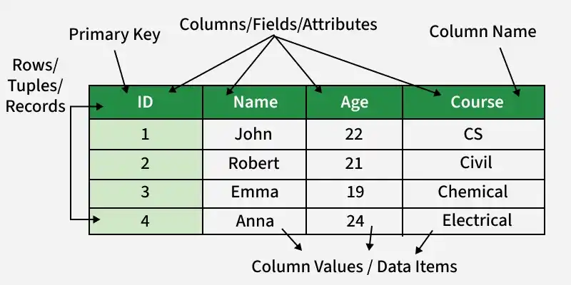
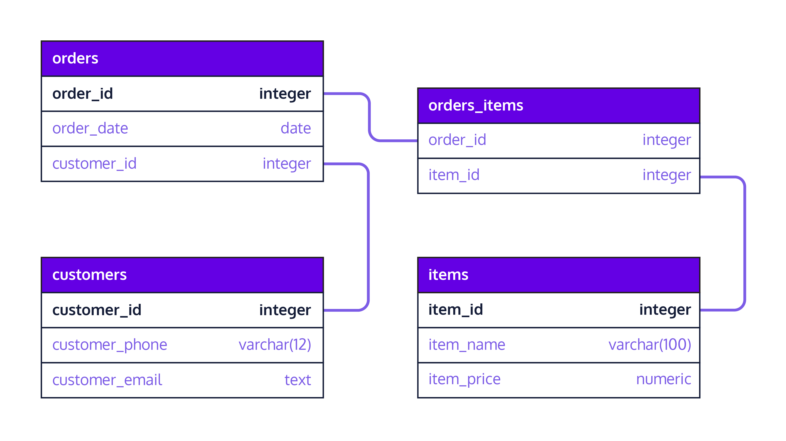

# OMIS 105
## Introduction to Database Management Systems
### Course Outline & Syllabus Overview
### Course Roadmap (10 Weeks)

**Instructor**: Dr. Mahmoud Parsian

**Quarter**: Fall 2026

**Schedule**: 

* 2 sessions per week, 
* 100 minutes each session
* 200 minutes/week

---

# Prerequisite

**Prerequisite**: OMIS 30 — Introduction to Programming

---

# Welcome to OMIS 105

* Every app you use — Amazon, Instagram, Uber, your bank — 
is powered by a **database**.

* This course gives you the skills to **design**, 
**build**, **query**, and **manage** databases that 
drive real business decisions.

* By the end of this course, 
  * you will think like a **data architect**, and 
  * write SQL like a **professional analyst**.

---

# What You Will Build

By the end of this course:

- Real databases
- Business-style queries
- Analytical insights
- A complete mini project

---

# Why Databases Matter

- The large majority of **Fortune 1000** companies rely on relational databases
- **SQL** is consistently one of the most requested technical skills in business analytics job postings
- Every business decision — pricing, inventory, marketing, finance — depends on **data stored in databases**
- Database skills bridge the gap between **business strategy** and **technical execution**

> "Data is the new oil, but only if you know how to refine it."

---

# Course Structure: The Journey

We move from:

👉 Basics    
→ Querying   
→ Design     
→ Systems   
→ Project

---

# What You Will Learn

By the end of this course, you will be able to:

1. **Design** a normalized relational database from business requirements
2. **Write** complex SQL queries to extract business insights
3. **Optimize** database performance with indexes and query tuning
4. **Manage** data integrity through transactions and constraints
5. **Build** a complete database project from scratch
6. **Communicate** database designs using ER diagrams

---

# Our Tools

| Tool | Role | Why This Tool? |
|------|------|----------------|
| **DuckDB** | Database engine | Zero setup, standard SQL, fast analytics |
| **Python** | Programming language | Industry standard, DuckDB integration |
| **Marimo Notebooks** | Interactive coding | Run SQL, see results instantly, document work |
| **qStudio** | Desktop SQL editor | Browse tables visually, save queries to a file |

All tools are **free** and **open source**.

---

# Our Dataset: ShopSmart E-Commerce

Throughout the course, we build a realistic **e-commerce database**:

| Table | Description | Rows |
|-------|-------------|------|
| `categories` | Product categories | 8 |
| `products` | Items across the 8 categories | 64 |
| `customers` | Buyers with contact info | 40 |
| `orders` | Purchase transactions | 200 |
| `order_items` | Line items per order | 607 |
| `reviews` | Customer product ratings | 150 |
| `suppliers` | Product vendors | 10 |
| `product_suppliers` | Which supplier sells which product | 90 |
| `shipping` | Delivery tracking | 141 |

The dataset **grows each week**, mirroring real-world complexity.

---

# Course Structure: The Big Picture

| Weeks | Theme | Focus |
|---|---|---|
| Week 1 | FOUNDATIONS | What are databases? |
| Week 2 | FOUNDATIONS | What are databases? How do they work? |
| Week 3 | SQL MASTERY | The language of data, basics |
| Week 4 | SQL MASTERY | The language of data, intermediate |
| Week 5 | SQL MASTERY | The language of data, intermediate |
| Week 6 | DESIGN | Building databases the right way |
| Week 7 | PERFORMANCE | Making databases fast |
| Week 8 | TRANSACTIONS | Making databases safe |
| Week 9 | PROJECT | Putting it all together |
| Week 10 | SYNTHESIS | Review, trends, and what's next |

---

# Each Week You Receive

| Material | Description |
|----------|-------------|
| **Slides** | Two Marp slide decks covering concepts and examples |
| **Dataset** | CSV files that grow in complexity week over week |
| **Demo Notebooks** | Marimo notebooks with live SQL demonstrations |
| **Lab (Student)** | Hands-on exercises to practice on your own |
| **Lab (Instructor)** | Full solutions for reference and grading |

---

<!-- _class: lead -->

# Week-by-Week Roadmap

---

# Week 1  
## Introduction to Databases

- What is a database?
- File systems vs DBMS
- Why databases matter
- First SQL query

👉 Goal: Build confidence

---

# Week 1 — Database Foundations

### What You Will Learn
- What databases are and why they replaced spreadsheets
- Core vocabulary: tables, rows, columns, schemas, data types
- Constraints that enforce data quality (PRIMARY KEY, NOT NULL, CHECK)
- Setting up DuckDB and writing your first SQL queries
- Basic SELECT, WHERE, ORDER BY, LIMIT, LIKE, and DISTINCT

---

# Week 1 — Business Insight

### Why This Matters in the Real World

**The cost of bad data**: IBM estimated that 
poor data quality costs the U.S. economy 
**$3.1 trillion per year** (2016). 

Flat files (spreadsheets) break down when:

- Two employees edit the same file simultaneously
- A typo in "Electronics" creates an invisible data silo
- Someone deletes a row and takes critical information with it

**Databases solve these problems** with structure, 
constraints, and controlled access. Understanding 
this foundation is the difference between a business 
that *reacts* to data problems and one that *prevents* them.

> Every data-driven company begins with a well-structured database.

---

# Week 2  
## Relational Model & Data Modeling

- Tables, rows, columns
- Primary keys, foreign keys
- Relationships (1-1, 1-M, M-M)
  - 1-1 (1 to 1)
  - 1-M (1 to Many)
  - M-M (Many to Many) 
- Intro to ER thinking

👉 Goal: Think in structure

---

## Table Relationships

- Relationships (1-1, 1-M, M-M)

- See details on [Table Relationships](./table_relationships.md)

---

# Relational Model: A Table: `students`

---

### Relational Model: Set of Tables

---

### Relational Model: Set of Tables

---

# Week 2 — Relational Thinking

### What You Will Learn
- The relational model (Edgar Codd, 1970 — still dominant today)
- Primary keys, foreign keys, candidate keys, composite keys
- Relationships: one-to-one, one-to-many, many-to-many
- Junction tables for complex relationships
- Entity-Relationship (ER) diagrams using Crow's Foot notation
- Referential integrity — why your data stays consistent

---

# Week 2 — Business Insight

### Why This Matters in the Real World

**Amazon** tracks millions of products, customers, and orders. 
If customer data were stored inside every order record:

- Updating one email address would require modifying **thousands of rows**
- Deleting a customer's last order would **erase their profile**
- Storage costs would **balloon** with redundant copies

The relational model stores each fact **exactly once** 
and links tables through keys. This is how businesses maintain 
**a single source of truth** across terabytes of data.

> Good relational design is invisible when it works — 
> and catastrophic when it doesn't.

---

# Week 3  
## SQL Core (Part 1)

- CREATE TABLE
- SELECT
- WHERE
- ORDER BY

👉 Goal: Ask questions with data

---

# Week 3 — SQL Mastery, Part 1: Querying a Single Table

### What You Will Learn
- SELECT — choosing which columns come back
- WHERE — filtering rows by a condition
- Comparison and logical operators: `=`, `>`, `<`, `AND`, `OR`, `NOT`
- ORDER BY — sorting results, ascending and descending
- LIMIT — returning only the first N rows
- DISTINCT — removing duplicate values
- Reading a result set critically: is this actually what I asked for?

---

# Week 3 — Business Insight

### Why This Matters in the Real World

An inventory manager asks: *"Show me every product over `$700`, most expensive first."*

That is one `SELECT`, one `WHERE`, one `ORDER BY` — and it is the shape of the overwhelming majority of questions asked of a database every day. Before anyone builds a dashboard, somebody has to be able to pull the right rows.

Getting this layer right also builds the habit that matters most: **checking that the rows you got back are the rows you meant to ask for.**

> Most real SQL is not clever. It is precise.

---

# Week 4  
## SQL Core (Part 2)

- Aggregation (`SUM`, `COUNT`, `AVG`, `MIN`, `MAX`)
- `GROUP BY`
- `HAVING`

👉 Goal: Generate insights

---

# Week 4 — SQL Mastery, Part 2: Functions & Aggregation

### What You Will Learn
- Aggregate functions: COUNT, SUM, AVG, MIN, MAX
- GROUP BY for summarizing data by category
- HAVING for filtering aggregated groups — and how it differs from WHERE
- String functions: UPPER, LOWER, CONCAT, SUBSTRING, LIKE/ILIKE
- Mathematical functions: ROUND, CEIL, FLOOR, ABS, POWER
- Date functions: EXTRACT, DATEDIFF, CURRENT_DATE, INTERVAL
- Conditional logic with CASE expressions

---

# Week 4 — Business Insight

### Why This Matters in the Real World

A marketing manager asks: *"Which product categories have an average price above `$50`, and what percentage of our catalog do they represent?"*

This question requires **grouping** products by category, **aggregating** prices, **filtering** groups by a threshold, and **computing** percentages — all in a single query.

Aggregation is the step where rows become *numbers a manager can act on*. It is what turns raw transactional data into the **executive dashboards** used at companies like Netflix, Spotify, and Target.

> The ability to ask precise questions of your data is a career-defining skill.

---

# Week 5  
## JOINs (Relational Power)

- INNER JOIN
- LEFT JOIN
- RIGHT JOIN
- Multi-table queries

👉 Goal: Connect data

---

# Week 5 — SQL Mastery, Part 3: JOINs

### What You Will Learn
- INNER JOIN — combining matching rows from two tables
- LEFT JOIN — keeping all rows from one side (finding gaps)
- RIGHT JOIN and FULL OUTER JOIN
- Self-joins for comparing rows within the same table
- Joining 3, 4, or 5 tables in a single query
- Combining JOINs with GROUP BY and HAVING
- Building multi-table business reports

---

# Week 5 — Business Insight

### Why This Matters in the Real World

Real business questions span **multiple tables**:

- *"Who are our top 10 customers by total spending?"* → customers + orders
- *"Which products have never been ordered?"* → products LEFT JOIN order_items
- *"What is revenue by category by month?"* → order_items + products + categories + orders

**JOINs** are arguably the single most important SQL skill: almost no real dataset lives in one table, so the ability to combine tables correctly is what separates someone who can query a spreadsheet from someone who can query a database.

> If you master JOINs, you can answer almost any business question.

---
# Week 6  
## Database Design & Normalization

- Bad vs good design
- 1NF, 2NF, 3NF (intuitive)
- Reducing redundancy

👉 Goal: Design clean databases

---

# Week 6 — Database Design & Normalization

### What You Will Learn
- Functional dependencies: the mathematical foundation of design
- Anomalies: update, insertion, and deletion problems
- First Normal Form (1NF): atomic values, no repeating groups
- Second Normal Form (2NF): eliminating partial dependencies
- Third Normal Form (3NF): eliminating transitive dependencies
- Boyce-Codd Normal Form (BCNF)
- When and how to denormalize for performance
- Hands-on: normalizing a messy denormalized table step by step

---

# Week 6 — Business Insight

### Why This Matters in the Real World

Imagine a healthcare system that stores a patient's name inside every appointment record instead of a separate `patients` table. When a patient changes their name after marriage:

- Every appointment row that mentions them needs a manual update, one at a time
- Miss even one, and a claim or a chart now disagrees with the patient's real name
- Nobody finds out until it causes a real problem — an insurance rejection, a mismatched record

Normalization prevents this by ensuring every fact is stored **exactly once**. It is the discipline that separates a database that works for 5 years from one that collapses under its own weight.

> Normalization is not academic theory — it is insurance against real-world data disasters.

---

# Week 7  
## Indexing & Performance

- What is an index?
- Why queries can be slow
- Performance intuition

👉 Goal: Think like a system

---
# Week 7 — Performance & Indexing

### What You Will Learn
- How a DBMS executes queries: parsing, optimization, execution
- Full table scans vs. index lookups
- B-Tree indexes: how they work and when to use them
- Composite and unique indexes
- EXPLAIN: reading and interpreting query execution plans
- Six query optimization techniques
- DuckDB's columnar storage and vectorized execution
- Measuring and benchmarking query performance

---

# Week 7 — Business Insight

### Why This Matters in the Real World

Imagine a retail company's daily sales report that takes almost an hour to run, because it scans every row of a multi-million-row `orders` table every single time. A DBA adds a few targeted indexes and rewrites the slowest subqueries:

- The same report now finishes in seconds instead of tens of minutes
- The database server has far more headroom to serve other users at the same time
- Nobody needs to buy bigger, more expensive hardware to fix a query that was just poorly written

Performance tuning is not about making things "a little faster." It is about the difference between a system that **scales** and one that **collapses** under load. The techniques in this week directly translate to cost savings and user satisfaction.

> A slow query is not just a technical problem — it is a business problem.

---

# Week 8  
## Transactions & ACID

- Transactions (`BEGIN`, `COMMIT`, `ROLLBACK`)
- ACID properties
- Data correctness

👉 Goal: Understand reliability

---

# Week 8 — Transactions & ACID

### What You Will Learn
- What transactions are and why they exist
- ACID properties: Atomicity, Consistency, Isolation, Durability
- BEGIN, COMMIT, ROLLBACK, and SAVEPOINT
- Concurrency problems: dirty reads, lost updates, phantom reads
- Isolation levels: READ UNCOMMITTED through SERIALIZABLE
- Locking mechanisms and deadlock prevention
- Error handling patterns in Python
- Building robust multi-step operations (order processing, returns)

---

# Week 8 — Business Insight

### Why This Matters in the Real World

In 2012, Knight Capital Group lost **$440 million in 45 minutes** due to a software deployment that executed trades without proper transaction controls. Partial updates ran unchecked, and there was no rollback mechanism.

Every time a customer clicks "Place Order," 
a transaction must:

1. Create the order record
2. Add each line item
3. Decrement inventory
4. Process payment

--- 

# Week 8 — Business Insight

### Why This Matters in the Real World

* If step 3 fails, steps 1 and 2 must be **undone**. 
* ACID guarantees are what make e-commerce, banking, and healthcare systems trustworthy.

> Transactions are the invisible contract between your system and your users.

---

# Week 9  
## Project (Integration)

- Design your own database
- Write real queries
- Generate insights

👉 Goal: Apply everything

---

# Week 9 — Capstone Project

### What You Will Do
- Choose a real-world domain (restaurant, gym, hospital, airline, etc.)
- Design an ER diagram with 5+ entities and proper relationships
- Create a normalized schema with constraints
- Load realistic sample data (20+ rows per main table)
- Write 10 diverse SQL queries demonstrating all skills learned
- Build a multi-step transaction with error handling
- Create views and indexes with justification
- Present your work in a live demo (5–8 minutes)

---

# Week 9 — Business Insight

### Why This Matters in the Real World

The capstone mirrors what database professionals do every day:

1. A stakeholder describes a business problem
2. You translate requirements into a **data model**
3. You build the schema, load data, and write queries
4. You present findings to **non-technical** decision-makers

This is the workflow at consulting firms (Deloitte, Accenture), tech companies (Google, Meta), and every startup that stores user data. Your capstone project becomes a **portfolio piece** that demonstrates end-to-end database competency.

> The project is where knowledge becomes capability.

---
# Week 10  
## Wrap-up & Modern Data

- Review key concepts
- Common mistakes
- Where SQL is used today

👉 Goal: Big-picture understanding

---

# Week 10 — Synthesis & Review

### What You Will Cover
- Capstone project presentations
- Modern database landscape: NoSQL, NewSQL, cloud databases
- Data lakes, lakehouses, and vector databases
- The DBA role: security, backup, capacity planning
- ETL pipelines and data warehousing
- Comprehensive review of all 10 weeks
- Practice problems covering every major topic
- Exam preparation strategies and key patterns to remember

---

# Week 10 — Business Insight

### Why This Matters in the Real World

The relational model you have learned is the **foundation** — but the landscape keeps evolving:

- **MongoDB** (document DB) powers real-time apps with flexible schemas
- **Redis** (key-value) handles millions of cache lookups per second
- **Neo4j** (graph DB) maps social networks and fraud detection
- **Snowflake** and **BigQuery** process petabytes in the cloud
- **Pinecone** (vector DB) enables AI-powered search and recommendations

Knowing relational databases gives you the vocabulary to evaluate any of these. The SQL you learn here transfers directly to BigQuery, Snowflake, and most modern data platforms.

> The best database professionals never stop learning — but they all started here.

---

<!-- _class: lead -->

# Course Policies & Logistics

---

# Grading Breakdown: 1000 points total

| Component     | Points | Weight | Description |
|----------------|-------:|--------|-------------|
| In-Class Labs  | 600    | 60%    | 20 labs × 30 points, one per class session |
| Midterm Exam   | 200    | 20%    | Comprehensive, covers Weeks 1–5 |
| Final Exam     | 200    | 20%    | Comprehensive, covers Weeks 1–10 |

* Your **lowest lab score is dropped**
* **Midterm and Final Exams**: closed book/notes/internet/software
* **Exams** require **LockDown Browser**

---

# Weekly Rhythm

| Session | When | Structure |
|---------|------|-----------|
| **Session 1** | Day 1, 2 hours | ~45 min lecture + live demo, then in-class lab — due by end of session |
| **Session 2** | Day 2, 2 hours | ~45 min lecture + live demo, then in-class lab — due by end of session |

Two labs per week, 20 labs total across the quarter.

---

# Attendance

Each week builds on the previous one — **attendance matters**.

* Each lab must be completed and submitted **during the class session in which it is assigned**
* If you are absent, you receive a **zero** on that lab — there is no makeup, since the lab environment and instructor support are only available in class

---

# Academic Integrity

- Labs are **individual** work unless stated otherwise
- You may discuss concepts but must write your own SQL
- Copying queries from classmates or AI tools without understanding them is a violation
- The capstone project must be **your own original design** (not a copy of ShopSmart)
- When in doubt, ask the instructor

---

# Getting Help

- **Office hours**: Announced during the first week of classes
- **Camino Discussions**: Post your question — the instructor, TA, and classmates respond
- **Email**: mparsian@scu.edu
- **Lab sessions**: Bring questions — we work through problems together
- **Peer study groups**: Encouraged! Teaching SQL to others deepens your own understanding

---

# Where Everything Lives

Everything for this course is on GitHub:

**https://github.com/mahmoudparsian/OMIS-105**

| Folder | What Is In It |
|--------|---------------|
| `software_installation/` | Set up your laptop — do this first |
| `weekly_lectures/` | Slides, demo notebooks, and data, week by week |
| `weekly_reviews/` | One review notebook per week |
| `tutorials/` | Standalone SQL and DuckDB walkthroughs |
| `course_information/` | Grading, attendance, and course policies |

New material is added every week. `tutorials/git/README.md` shows you how to
download the repository once and refresh it with a single command.

---

# Recommended Preparation

Before Week 1:

1. **Install the software** — follow `software_installation/README.md`
   in the course repository, start to finish. It installs Python, DuckDB,
   Marimo, Pandas, Matplotlib, and qStudio, and verifies each one
2. **Review OMIS 30** material — variables, loops, functions
3. **Skim** a SQL tutorial online (any free resource)

Only step 1 matters — do it before the first class. Steps 2 and 3 are
optional; we start SQL from the beginning.

---

# The Skills You Will Graduate With

| Skill | Outcome |
|---|---|
| Database Design | Architect data systems |
| SQL Querying | Extract insights from any dataset |
| Normalization | Build maintainable, scalable schemas |
| Performance Tuning | Make systems fast and cost-effective |
| Transaction Management | Ensure data integrity and safety |
| Project Delivery | Design, build, present, and defend |

These are the skills hiring managers look for in:
**Data Analysts, Business Analysts, Software Engineers,
Product Managers, and Management Consultants.**

---

# How You Will Learn

- Hands-on labs every week
- Real datasets
- Business-style questions
- Step-by-step notebooks

---

# What I Expect From You

- Practice SQL regularly
- Ask questions
- Think in terms of data

---

# What You Can Expect From Me

- Clear explanations
- Practical examples
- Support throughout the course

---

# Final Thought

This course is not about memorizing SQL.

👉 It is about thinking with data

---

# Let's Get Started 🚀

> * The best time to learn databases was 10 years ago.  
> * The second best time is today.

Welcome to OMIS 105.  
Let's build something great.

---

# Questions?

**Dr. Mahmoud Parsian**  
mparsian@scu.edu  
Leavey School of Business  
Santa Clara University 

Thank you!

---

# Appendix — Advanced SQL (Preview)

### Where the second half of the quarter is heading

Weeks 1–5 take SQL as far as **JOINs**. The techniques below build on that
foundation. **Window functions and CTEs come back in Weeks 7 and 9** — you are
seeing them early here, not instead. The remaining items (set operations, views,
RFM analysis) are enrichment: they appear in several of the `data_stories/`
notebooks for students who want to read ahead.

- Window functions: ROW_NUMBER, RANK, LAG, LEAD, NTILE
- Running totals and moving averages
- Percent-of-total calculations
- Common Table Expressions (CTEs) for readable, modular queries
- Set operations: UNION, INTERSECT, EXCEPT
- Creating and using Views — saved queries as virtual tables
- RFM analysis (Recency, Frequency, Monetary) for customer segmentation

---

# Appendix — Why Advanced SQL Matters

### Why This Matters in the Real World

A VP of Sales asks: *"Show me our monthly revenue trend with month-over-month growth, and flag any month where we declined."*

This requires **LAG** (to compare with the previous month), a **CTE** (to organize the logic), and **CASE** (to flag declines). These are the queries behind the dashboards in **Tableau**, **Power BI**, and **Looker**.

Window functions transform SQL from a data retrieval tool into a **full analytical engine** — eliminating the need to export to Excel for most analyses.

> Advanced SQL is the difference between "I can get the data" and "I can deliver the insight."
