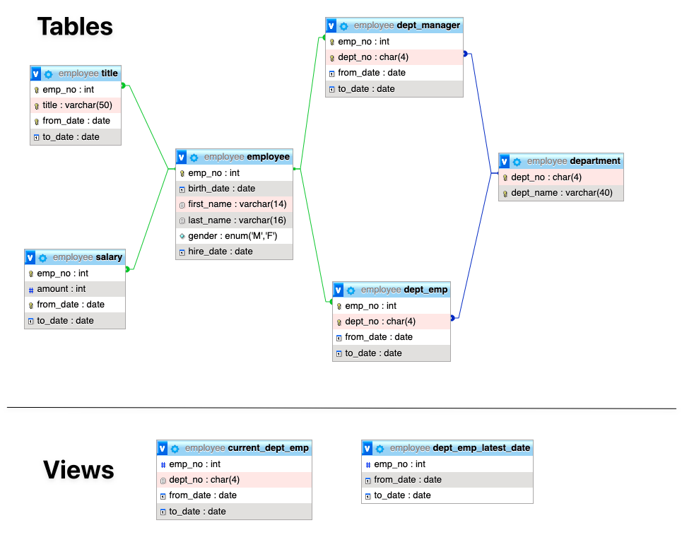

# Employee Sample Database for MySQL

**The HR database that taught a generation of DBAs to JOIN.**

## The Story

Most "sample databases" are obviously fake — three customers, five
orders, done. This one isn't. Back in the late 1990s, researchers
Fusheng Wang and Carlo Zaniolo built a genuinely realistic, temporal
HR dataset for database research: employees hired over a 15-year
span, salaries that rise (and sometimes dip) year over year, people
who get promoted, transferred between departments, and occasionally
manage the department they used to just work in. In 2007, MySQL AB's
Giuseppe Maxia turned it into the schema you see here, and it shipped
as MySQL's official `employees` sample database — the one installed
on countless tutorials, textbooks, and job interviews ever since.

This copy comes from the community-maintained fork,
[`datacharmer/test_db`](https://github.com/datacharmer/test_db), with
two changes for this course:

- **`dataset_small`** — a ~600 KB, 1,000-employee slice (about 0.3%
  of the full 300,024-employee dataset) — small enough to load
  instantly, still large enough that `GROUP BY`, multi-year salary
  trends, and manager turnover all produce real, varied answers.
- **Singular table names** (`employees` → `employee`,
  `departments` → `department`, ...) to match this course's naming
  convention.

Six tables, one shared employee ID scheme, real history — that's
what makes department reassignments, raises, and title changes in
this dataset feel like *events*, not just rows.

> **OMIS 105 note:** this `mysql/` folder is a **reference only** — it
> documents the original dataset this course's database was built
> from. For labs, use the self-contained DuckDB version instead: see
> [`../duckdb/README.md`](../duckdb/README.md). It needs no MySQL
> server, and does not read anything from this folder at runtime.

## Schema



## Prerequisites

You need a MySQL database server (5.0+) and run the commands below through a
user that has the following privileges:

    SELECT, INSERT, UPDATE, DELETE,
    CREATE, DROP, RELOAD, REFERENCES,
    INDEX, ALTER, SHOW DATABASES,
    CREATE TEMPORARY TABLES,
    LOCK TABLES, EXECUTE, CREATE VIEW

## Installation:

1. Download the repository
2. Change directory to the repository
3. Change directory to  `dataset_small`

Run:

```bash
cd dataset_small
```

Then run

```
mysql < employee.sql
```

## Testing the installation

### Testing `dataset_small`

    // Under 'dataset_small' directory
    mysql -t < test_employee_md5.sql

    +----------------------+
    | INFO                 |
    +----------------------+
    | TESTING INSTALLATION |
    +----------------------+
    +--------------+-----------------+----------------------------------+
    | table_name   | expected_record | expected_crc                     |
    +--------------+-----------------+----------------------------------+
    | department   |               9 | d1af5e170d2d1591d776d5638d71fc5f |
    | dept_emp     |            1103 | e302aa5b56a69b49e40eb0d60674addc |
    | dept_manager |              16 | 8ff425d5ad6dc56975998d1893b8dca9 |
    | employee     |            1000 | 595460127fb609c2b110b1796083e242 |
    | salary       |            9488 | 61f22cfece4d34f5bb94c9f05a3da3ef |
    | title        |            1470 | ba77dd331ce00f76c1643a7d73cdcee6 |
    +--------------+-----------------+----------------------------------+
    +--------------+------------------+----------------------------------+
    | table_name   | found_records    | found_crc                        |
    +--------------+------------------+----------------------------------+
    | department   |                9 | d1af5e170d2d1591d776d5638d71fc5f |
    | dept_emp     |             1103 | e302aa5b56a69b49e40eb0d60674addc |
    | dept_manager |               16 | 8ff425d5ad6dc56975998d1893b8dca9 |
    | employee     |             1000 | 595460127fb609c2b110b1796083e242 |
    | salary       |             9488 | 61f22cfece4d34f5bb94c9f05a3da3ef |
    | title        |             1470 | ba77dd331ce00f76c1643a7d73cdcee6 |
    +--------------+------------------+----------------------------------+
    +--------------+---------------+-----------+
    | table_name   | records_match | crc_match |
    +--------------+---------------+-----------+
    | department   | OK            | ok        |
    | dept_emp     | OK            | ok        |
    | dept_manager | OK            | ok        |
    | employee     | OK            | ok        |
    | salary       | OK            | ok        |
    | title        | OK            | ok        |
    +--------------+---------------+-----------+
    +------------------+
    | computation_time |
    +------------------+
    | 00:00:00         |
    +------------------+
    +---------+--------+
    | summary | result |
    +---------+--------+
    | CRC     | OK     |
    | count   | OK     |
    +---------+--------+

## Installing the function (optional)

```bash
mysql < object.sql
```

**If you are connecting to a cloud instance such as AWS RDS. You MUST turn off binary logging first. Otherwise, you will encounter error**

    You do not have the SUPER privilege and binary logging is enabled (you *might* want to use the less safe log_bin_trust_function_creators variable)

`object.sql`'s stored FUNCTIONs/PROCEDUREs (`emp_dept_id`,
`emp_dept_name`, `emp_name`, `current_manager`, `show_department`,
`v_full_employee`, `v_full_department`, ...) have been ported to
DuckDB MACROs for OMIS 105 — see
[`../duckdb/sql/06_object.sql`](../duckdb/sql/06_object.sql) and the
["Use of DuckDB Macros"](../duckdb/README.md#use-of-duckdb-macros)
section of the DuckDB README.

---
*OMIS 105 — Introduction to Database Management Systems — Fall 2026*
